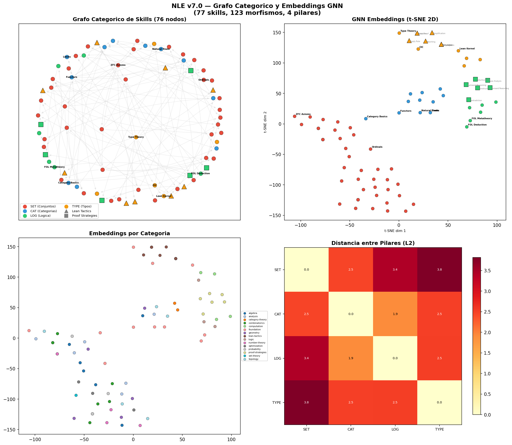

# Demostrador de Enunciados Matemáticos

[](https://python.org/)
[](#tests)
[](https://pytorch.org/)
[](LICENSE)

**Framework para demostración matemática asistida** — NLE v7.0 (Núcleo Lógico Evolutivo)

📚 **Documentación**: [Instalación](INSTALACION.md) | [Ejemplos](EJEMPLOS.md) | [Inicio Rápido](INICIO_RAPIDO.md) | [Fundamentos Teóricos](FUNDAMENTOS_TEORICOS.md) | [Cómo Citar](CITATION.md) | [Mejoras Recientes](docs/MEJORAS_RECIENTES.pdf)

> **Papers fundacionales**:
> - Jiménez Martínez, L. (2025). *NLE v7.0: Núcleo Lógico Evolutivo basado en Memory Evolutive Systems de Ehresmann*. UNAM. [PDF](docs/NLE_v7_MES_Ehresmann.pdf)
> - Jiménez Martínez, L. (2025). *NLE v7.0 Unificado: Dinámica Global y Co-reguladores*. UNAM. [PDF](docs/NLE_v7_Unificado_MES.pdf)

---

## ¿Qué es este sistema?

Es un **framework de demostración matemática** que organiza conocimiento usando teoría de categorías y Memory Evolutive Systems (MES). Incluye:

✅ **Consulta a Claude** para responder preguntas matemáticas en lenguaje natural
✅ **Genera código Lean 4** para formalización (requiere Lean instalado para verificar)
✅ **76 skills matemáticos** en un grafo categórico jerárquico (incluye 9 tácticas Lean + 6 estrategias de prueba)
✅ **Red neuronal GNN+PPO** para decisiones aprendidas (Graph Attention Network + Actor-Critic)
✅ **Aprendizaje en vivo** — el sistema aprende de cada interacción real y mejora con el uso
✅ **Memoria de patrones exitosos** — recuerda qué tácticas funcionaron y las reutiliza

### Ejemplo de uso

```
Tu > ¿Qué es un grupo en álgebra abstracta?
[RESPONSE | confianza: 0.85]
Un grupo es una estructura algebraica (G, ·) donde:
 - G es un conjunto con una operación binaria ·
 - Es asociativa: (a·b)·c = a·(b·c)
 - Tiene elemento neutro e: a·e = e·a = a
 - Todo elemento tiene inverso: a·a⁻¹ = e

Tu > Formaliza eso en Lean 4
[RESPONSE | confianza: 0.85]
class Group (G : Type u) where
  mul : G → G → G
  one : G
  inv : G → G
  mul_assoc : ∀ a b c, mul (mul a b) c = mul a (mul b c)
  ...
```

---

## Arquitectura del Sistema

```
┌─────────────────────────────────────────────────────────────────┐
│                    NÚCLEO LÓGICO EVOLUTIVO v7.0                  │
├─────────────────────────────────────────────────────────────────┤
│                                                                 │
│  Usuario ──> Claude AI ──> Dinámica Global ──> Lean 4          │
│                                │                                │
│                          (4 Co-reguladores)                     │
│                                v                                │
│              ┌─────────────────────────────────┐                │
│              │  GRAFO CATEGÓRICO DE SKILLS     │                │
│              │                                 │                │
│              │  76 skills matemáticos:         │                │
│              │  - 10 fundamentales (nivel 0)   │                │
│              │  - 51 de dominio (niveles 1-2)  │                │
│              │  - 9 tácticas Lean (nivel 1)    │                │
│              │  - 6 estrategias de prueba (L2) │                │
│              │                                 │                │
│              │  4 Pilares:                     │                │
│              │  SET | CAT | LOG | TYPE         │                │
│              └────────────┬────────────────────┘                │
│                           │                                     │
│              ┌────────────v────────────────────┐                │
│              │  GNN ENCODER (GATConv x3)       │                │
│              │  graph_to_pyg() → SkillGNN      │                │
│              │  → embedding [64 dims]          │                │
│              └────────────┬────────────────────┘                │
│                           │                                     │
│              ┌────────────v────────────────────┐                │
│              │  ACTOR-CRITIC (PPO)              │                │
│              │  Query encoder + Goal encoder   │                │
│              │  → Fusion → Actor (3 acciones)  │                │
│              │           → Critic (valor)      │                │
│              └────────────┬────────────────────┘                │
│                           │                                     │
│              ┌────────────v────────────────────┐                │
│              │  RED DE CO-REGULADORES (MES)    │                │
│              │                                 │                │
│              │  • CR_tac: Táctico (rápido)     │                │
│              │  • CR_org: Organizacional       │                │
│              │  • CR_str: Estratégico          │                │
│              │  • CR_int: Integridad           │                │
│              │                                 │                │
│              │  Memoria: Empírica → Procedural │                │
│              │    → Semántica → E-conceptos    │                │
│              └─────────────────────────────────┘                │
│                                                                 │
│  APRENDIZAJE EN VIVO:                                          │
│  Chat → Decisión → Reward → PPO Update → Mejor decisión       │
│  Patrones exitosos se guardan en memoria procedural            │
└─────────────────────────────────────────────────────────────────┘
```

### Visualización del Grafo de Skills y Embeddings GNN



*77 skills organizados en 4 pilares, con embeddings GNN proyectados a 2D via t-SNE. Los triángulos son tácticas Lean, los cuadrados son estrategias de prueba.*

---

## Novedades Recientes

### GNN + PPO (Red Neuronal)

El sistema ahora incluye una **red neuronal** de 124,420 parámetros:

- **SkillGNN**: 3 capas de Graph Attention Network (GATConv) que codifican el grafo de skills en vectores de 64 dimensiones
- **ActorCriticNetwork**: Red Actor-Critic para PPO (Proximal Policy Optimization)
  - Actor: selecciona entre 3 acciones (RESPONSE, REORGANIZE, ASSIST)
  - Critic: estima el valor de cada estado
- **Encoders**: bag-of-keywords para queries (33 términos matemáticos) + hash determinista para goals Lean

### 15 Nuevos Skills de Lean y Pruebas

**9 Tácticas Lean** (nivel 1, pilar TYPE):
| Skill | Tácticas | Descripción |
|-------|----------|-------------|
| `tactic-simp` | simp, simp_all, norm_num | Simplificación automatizada |
| `tactic-rewrite` | rw, conv | Reescritura de términos |
| `tactic-exact` | exact, refine, use | Proveer términos exactos |
| `tactic-apply` | apply, have, suffices | Aplicación de reglas |
| `tactic-induction` | induction, cases, rcases | Inducción estructural |
| `tactic-omega` | omega, linarith | Aritmética lineal |
| `tactic-ring` | ring, ring_nf, field_simp | Normalización algebraica |
| `tactic-aesop` | aesop, decide, tauto | Búsqueda automática |
| `tactic-calc` | calc blocks | Razonamiento ecuacional |

**6 Estrategias de Prueba** (nivel 2, pilar LOG):
| Skill | Descripción |
|-------|-------------|
| `strategy-backward` | Razonamiento hacia atrás (goal-directed) |
| `strategy-forward` | Razonamiento hacia adelante (desde hipótesis) |
| `strategy-contradiction` | Prueba por contradicción (by_contra) |
| `strategy-cases` | Análisis por casos exhaustivo |
| `strategy-inductive` | Patrón inductivo: base + paso |
| `strategy-construction` | Construcción de testigos (use/exact) |

### Aprendizaje en Vivo

El sistema **aprende de cada interacción real**:

1. El usuario hace una consulta en el chat
2. La Dinámica Global decide qué acción tomar
3. Se ejecuta y se evalúa el resultado (reward real)
4. El resultado alimenta una actualización PPO incremental
5. Los patrones exitosos se guardan en memoria procedural
6. En futuras consultas similares, el sistema usa el patrón probado

```
Chat → Decisión → Reward → PPO Update → Mejor Decisión
                              ↓
                    Memoria Procedural
                    (query, táctica, success_rate)
```

---

## Los 4 Pilares del Conocimiento

| Pilar | Qué es | Ejemplos |
|-------|--------|----------|
| **SET** | Teoría de Conjuntos (ZFC) | Axiomas ZFC, ordinales, cardinales |
| **CAT** | Teoría de Categorías | Funtores, transformaciones naturales, límites |
| **LOG** | Lógica (FOL + Intuicionista) | Deducción natural, metateoría, completitud |
| **TYPE** | Teoría de Tipos (CIC/Lean 4) | Cálculo de construcciones, tácticas Lean |

### Los 76 Skills Matemáticos (14 categorías)

| Categoría | Skills | Niveles |
|-----------|--------|---------|
| **Álgebra** (7) | Grupos, anillos, campos, álgebra lineal, módulos | L1-L2 |
| **Geometría** (6) | Euclidiana, diferencial, proyectiva, algebraica | L1-L2 |
| **Análisis** (6) | Real, complejo, medida, funcional, armónico | L1-L2 |
| **Topología** (5) | Punto-conjunto, algebraica, diferencial, homotopía | L1-L2 |
| **Lógica** (3) | Teoría de modelos, demostración, HoTT | L1-L2 |
| **Teoría de Números** (4) | Elemental, algebraica, analítica, aritmética | L1-L2 |
| **Combinatoria** (6) | Enumerativa, grafos, matroides, extremal | L1-L2 |
| **Probabilidad** (4) | Probabilidad, procesos estocásticos, ergódica | L1-L2 |
| **Teoría de Conjuntos** (1) | Descriptiva | L1 |
| **Teoría de Categorías** (2) | Topos, álgebra homológica categórica | L1-L2 |
| **Computación** (4) | Algoritmos, lenguajes formales, complejidad | L1-L2 |
| **Optimización** (3) | Convexa, variacional, control óptimo | L1-L2 |
| **Tácticas Lean** (9) | simp, rw, exact, apply, induction, omega, ring, aesop, calc | L1 |
| **Estrategias de Prueba** (6) | backward, forward, contradiction, cases, inductive, construction | L2 |

---

## Instalación

### Requisitos Previos

- **Python 3.10 o superior**
- **PyTorch 2.0+** (para la red neuronal GNN+PPO)
- **torch-geometric 2.3+** (para Graph Attention Networks)
- **Cuenta de Anthropic** (para usar Claude AI, opcional)
- *(Opcional)* Lean 4 instalado para verificación formal

### Paso 1: Clonar el repositorio

```bash
git clone https://github.com/metamatematico/Demostrador-de-enunciados-matem-ticos.git
cd Demostrador-de-enunciados-matem-ticos
```

### Paso 2: Instalar dependencias

```bash
# Dependencias base
pip install pyyaml rich anthropic

# Red neuronal (GNN + PPO)
pip install torch torch-geometric

# Visualización (opcional)
pip install matplotlib scikit-learn networkx
```

### Paso 3: Configurar API key de Anthropic (opcional)

Para usar Claude AI real necesitas una API key de Anthropic (https://console.anthropic.com).
**Sin API key el sistema funciona en modo mock** (respuestas simuladas, útil para explorar).

**Opción A — Variable de entorno** (recomendado):
```cmd
:: Windows CMD
set ANTHROPIC_API_KEY=sk-ant-tu-clave-aqui

:: Windows PowerShell
$env:ANTHROPIC_API_KEY="sk-ant-tu-clave-aqui"

:: Linux/Mac
export ANTHROPIC_API_KEY=sk-ant-tu-clave-aqui
```

**Opción B — En `nucleo_config.yaml`**:
```yaml
llm:
  model: "claude-sonnet-4-20250514"
  api_key: "sk-ant-tu-clave-aqui"
```

**Opción C — Modo mock** (sin API key):
El sistema arranca normalmente y muestra un aviso. Las respuestas serán simuladas.

### Paso 4: Verificar instalación

```bash
python -c "from nucleo.core import Nucleo; print('Instalación correcta')"
```

---

## Uso del Sistema

### Chat Interactivo con Claude

```bash
python -m nucleo chat
```

> **PowerShell**: Si usas el intérprete de Python con ruta completa, necesitas el operador `&`:
> ```powershell
> & "C:/Users/tu-usuario/anaconda3/envs/tu-env/python.exe" -m nucleo chat
> ```

### Comandos Especiales del Chat

| Comando | Función |
|---------|---------|
| `/help` | Muestra ayuda |
| `/stats` | Estadísticas del sistema (skills, memoria, co-reguladores) |
| `/skills` | Lista los 76 skills matemáticos por pilar |
| `/axioms` | Verifica los axiomas formales del sistema (8.1-8.4) |
| `/clear` | Limpia el historial de conversación |
| `/quit` | Salir del chat |

### Opciones del Chat

```bash
# Usar modelo más rápido y económico
python -m nucleo chat --model claude-haiku-4-5-20251001

# Modo verbose (ver decisiones de los co-reguladores)
python -m nucleo chat --verbose
```

### Visualizar el Grafo de Skills

```bash
python -m scripts.visualize_embeddings         # Guardar PNG
python -m scripts.visualize_embeddings --show   # Abrir ventana interactiva
```

Genera una visualización con 4 paneles: grafo categórico, embeddings t-SNE, clusters por categoría, y distancias entre pilares.

---

## Uso Programático (Python)

```python
import asyncio
from nucleo.core import Nucleo
from nucleo.config import NucleoConfig

async def main():
    config = NucleoConfig()
    nucleo = Nucleo(config=config)
    await nucleo.initialize()

    # Consulta (la Dinámica Global decide la acción)
    response = await nucleo.process("¿Qué es un grupo abeliano?")
    print(f"Acción: {response.action_type.name}")
    print(f"Confianza: {response.confidence:.2f}")
    print(f"Respuesta:\n{response.content}")

asyncio.run(main())
```

### Con Red Neuronal (GNN+PPO)

```python
from nucleo.rl.agent import NucleoAgent, AgentConfig
from nucleo.rl.gnn import graph_to_pyg
from nucleo.rl.networks import encode_query

# Crear agente con red neuronal
agent = NucleoAgent(nucleo.graph, use_neural=True)

# Conectar al Nucleo para aprendizaje en vivo
nucleo.set_neural_agent(agent)

# Cada process() ahora alimenta PPO con rewards reales
response = await nucleo.process("Demuestra que todo grupo cíclico es abeliano")
```

---

## Estructura del Proyecto

```
Demostrador-de-enunciados-matematicos/
│
├── nucleo/                      # Sistema NLE v7.0 (~13,500 líneas)
│   ├── core.py                  #   Orquestador + live learning hook
│   ├── cli.py                   #   Interfaz de línea de comandos
│   ├── __main__.py              #   Entry point: python -m nucleo
│   ├── types.py                 #   Tipos: Skill, Morphism, Pattern, etc.
│   ├── config.py                #   Configuración
│   │
│   ├── graph/                   #   Grafo categórico de skills
│   │   ├── category.py          #     Categoría jerárquica + axiomas
│   │   ├── evolution.py         #     Sistema evolutivo + teoremas
│   │   ├── operations.py        #     Operaciones sobre el grafo
│   │   └── embeddings.py        #     Embeddings de skills
│   │
│   ├── mes/                     #   Dinámica Global (MES)
│   │   ├── co_regulators.py     #     4 co-reguladores + neural_agent
│   │   ├── memory.py            #     Memoria + get_best_for_query()
│   │   └── patterns.py          #     Patrones, colímites
│   │
│   ├── rl/                      #   Aprendizaje por Refuerzo
│   │   ├── gnn.py               #     GNN Encoder (GATConv x3)
│   │   ├── networks.py          #     ActorCriticNetwork (PPO)
│   │   ├── agent.py             #     NucleoAgent + memoria + PPO
│   │   ├── mdp.py               #     Proceso de decisión de Markov
│   │   └── rewards.py           #     Función de recompensa
│   │
│   ├── lean/                    #   Integración con Lean 4
│   │   ├── client.py            #     Cliente Lean 4
│   │   ├── solver_cascade.py    #     9 solvers automáticos
│   │   ├── sorry_analyzer.py    #     Análisis de sorry's
│   │   └── ...
│   │
│   ├── pillars/                 #   4 Pilares + 66 dominios
│   │   ├── set_theory.py        #     ZFC
│   │   ├── category_theory.py   #     Teoría de Categorías
│   │   ├── logic.py             #     Lógica (FOL + IL)
│   │   ├── type_theory.py       #     Teoría de Tipos (CIC/Lean)
│   │   └── math_domains.py      #     66 dominios (51 math + 15 Lean/pruebas)
│   │
│   ├── llm/                     #   Integración con Claude
│   │   ├── client.py            #     Cliente API de Anthropic
│   │   └── prompts.py           #     Plantillas de prompts
│   │
│   └── eval/                    #   Evaluación
│       └── math_evaluator.py    #     Verificación de respuestas
│
├── tests/                       #   352 tests (16 suites)
│   ├── test_graph.py            #     Categoría de skills
│   ├── test_evolution.py        #     Sistema evolutivo
│   ├── test_colimits.py         #     Patrones y colímites
│   ├── test_gnn.py              #     GNN encoder (19 tests)
│   ├── test_ppo.py              #     PPO Actor-Critic (25 tests)
│   ├── test_live_learning.py    #     Live learning + Lean skills (24 tests)
│   ├── test_math_domains.py     #     66 dominios matemáticos
│   └── ...
│
├── scripts/                     #   Utilidades
│   └── visualize_embeddings.py  #     Visualización del grafo + embeddings
│
├── data/                        #   Datos generados
│   └── skill_embeddings.png     #     Visualización del grafo
│
├── docs/                        #   Documentación y papers
│   ├── NLE_v7_MES_Ehresmann.pdf
│   ├── NLE_v7_Unificado_MES.pdf
│   └── MEJORAS_RECIENTES.pdf    #     Mejoras e implementaciones recientes
│
├── examples/                    #   Ejemplos de uso
├── nucleo_config.yaml           #   Configuración por defecto
├── pyproject.toml               #   Metadata del proyecto
└── README.md                    #   Este archivo
```

---

## Tests

El sistema incluye **352 tests** que verifican todas las funcionalidades:

```bash
python -m pytest tests/ -v
```

| Suite | Tests | Qué prueba |
|-------|-------|------------|
| test_types | 10 | Tipos básicos (Skill, Morphism, State, Action) |
| test_graph | 12 | Categoría de skills, axiomas, serialización |
| test_pillars | 16 | 4 pilares fundamentales |
| test_evolution | 10 | Snapshots, funtores de transición |
| test_colimits | 26 | Patrones, co-conos, propiedad universal |
| test_emergence | 14 | Links simples/complejos, emergencia |
| test_multiplicity | 10 | Homología, multiplicidad |
| test_coregulators | 19 | Red de co-reguladores |
| test_memory | 16 | E-equivalencia, E-conceptos |
| test_lean_integration | 48 | Cascade de solvers, analizador de sorry's |
| test_formal_properties | 26 | Axiomas 8.1-8.4, Teoremas 8.5-8.7 |
| test_math_domains | 32 | 66 dominios matemáticos + dependencias |
| test_cli | 10 | CLI, chat interactivo |
| test_gnn | 19 | GNN encoder, graph_to_pyg, GATConv |
| test_ppo | 25 | Actor-Critic, PPO update, save/load |
| test_live_learning | 24 | Lean skills, memoria, aprendizaje en vivo |
| **Total** | **352** | |

---

## Estado del Proyecto

| Fase | Descripción | Estado |
|------|-------------|--------|
| 0 | Bugfixes críticos | ✅ Completado |
| 1 | Colímites y propiedad universal | ✅ Completado |
| 2 | Sistema evolutivo | ✅ Completado |
| 3 | Emergencia | ✅ Completado |
| 4 | Multiplicidad | ✅ Completado |
| 5 | Co-reguladores + Memoria | ✅ Completado |
| 6 | Integración Lean | ✅ Completado |
| 7 | Propiedades formales | ✅ Completado |
| 8 | GNN + PPO (red neuronal) | ✅ Completado |
| 9 | Skills Lean + Aprendizaje en vivo | ✅ Completado |

**Progreso global: ~95%**

### Trabajo Pendiente

- [ ] Dataset de entrenamiento con problemas matemáticos reales
- [ ] Entrenamiento completo de pesos GNN+PPO
- [ ] Pipeline de evaluación end-to-end
- [x] ~~Red neuronal (GNN+PPO)~~ (implementado)
- [x] ~~Memoria persistente entre sesiones~~ (implementado)
- [x] ~~Skills de tácticas Lean~~ (9 skills implementados)
- [x] ~~Aprendizaje en vivo~~ (implementado)
- [ ] Soporte para otros LLMs (GPT-4, Gemini)

---

## Preguntas Frecuentes (FAQ)

### ¿Necesito saber programación para usar el sistema?

**No.** El sistema tiene un chat interactivo muy simple:
```bash
python -m nucleo chat
```
Solo escribe tus preguntas en español y el sistema responde.

### ¿Cuánto cuesta usar Claude AI?

Depende del modelo:
- **claude-haiku-4-5-20251001**: ~$0.25 por millón de tokens (muy barato)
- **claude-sonnet-4-20250514**: ~$3 por millón de tokens (calidad alta)

Una sesión típica de chat (10-20 preguntas) cuesta menos de $0.10 USD.

### ¿El sistema tiene inteligencia artificial propia?

**Sí**, ahora incluye:
- Una **red neuronal GNN+PPO** (124K parámetros) que aprende a seleccionar acciones
- **Aprendizaje en vivo**: cada interacción real mejora la red
- **Memoria de patrones**: recuerda qué tácticas funcionaron en problemas similares

La red aún no está entrenada con un dataset grande, pero la infraestructura está completa y aprende incrementalmente con el uso.

### ¿El sistema aprende de mis consultas?

**Sí**, de tres formas:
1. **Memoria MES**: acumula experiencias (empírica → semántica)
2. **PPO en vivo**: cada interacción actualiza la red neuronal
3. **Patrones exitosos**: si una táctica funciona, se guarda y reutiliza

### ¿Funciona sin conexión a Internet?

**Parcialmente**. Sin Internet:
- La red neuronal GNN+PPO funciona localmente
- Los skills y la memoria funcionan localmente
- Las respuestas en lenguaje natural requieren Claude (Internet)

---

## Solución de Problemas

### Aviso: "No se encontró API key de Anthropic"

Esto **no es un error** — el sistema arranca en modo mock. Para usar Claude real:
```bash
set ANTHROPIC_API_KEY=sk-ant-tu-clave          # CMD
$env:ANTHROPIC_API_KEY="sk-ant-tu-clave"       # PowerShell
export ANTHROPIC_API_KEY=sk-ant-tu-clave       # Linux/Mac
```

### Error: "No module named 'torch_geometric'"

```bash
pip install torch-geometric
```

### Error en PowerShell: "Unexpected token '-m'"

**Solución:** Usar el operador `&`:
```powershell
& "C:/ruta/a/python.exe" -m nucleo chat
```

### Error: "No module named 'nucleo'"

Asegúrate de estar en la carpeta correcta:
```bash
cd Demostrador-de-enunciados-matematicos
python -m nucleo chat
```

### Los tests fallan

```bash
pip install pytest torch torch-geometric
python -m pytest tests/ -o "addopts=" -v
```

---

## Referencias

### Especificación del Sistema

**Jiménez Martínez, L. (2025).** *NLE v7.0: Núcleo Lógico Evolutivo basado en Memory Evolutive Systems de Ehresmann*. Universidad Nacional Autónoma de México (UNAM). [PDF](docs/NLE_v7_MES_Ehresmann.pdf)

### Fundamentos Teóricos

**Memory Evolutive Systems (MES):**
- Ehresmann, A. C., & Vanbremeersch, J. P. (2007). *Memory Evolutive Systems: Hierarchy, Emergence, Cognition*. Elsevier.
- Ehresmann, A. C. (2012). MENS, a mathematical model for cognitive systems. *Journal of Mind Theory*, 0(2).

**Solver Cascade (APOLLO):**
- Wang et al. (2025). APOLLO: Automated LLM and Lean Collaboration for Mathematical Reasoning. *arXiv:2505.05758*.

**PPO y GNN:**
- Schulman, J. et al. (2017). Proximal Policy Optimization Algorithms. *arXiv:1707.06347*.
- Velickovic, P. et al. (2018). Graph Attention Networks. *ICLR 2018*.

**Lean 4 y Mathlib:**
- [Mathlib4 Documentation](https://leanprover-community.github.io/mathlib4_docs/)
- [Theorem Proving in Lean 4](https://lean-lang.org/theorem_proving_in_lean4/)

---

## Autor

**Leonardo Jiménez Martínez**
Universidad Nacional Autónoma de México (UNAM)

---

## Licencia

MIT License. Ver [LICENSE](LICENSE) para detalles.

---

## Agradecimientos

- **Anthropic** por Claude AI
- **Lean Community** por Mathlib4
- **Andrée Ehresmann** por la teoría MES
- **PyTorch Geometric** por la infraestructura de GNN
