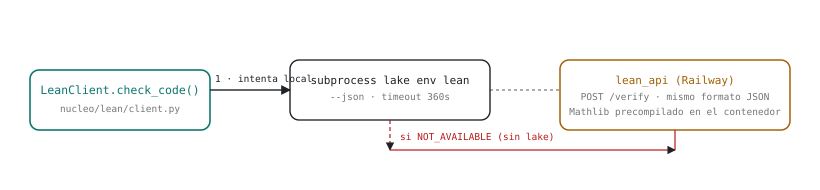
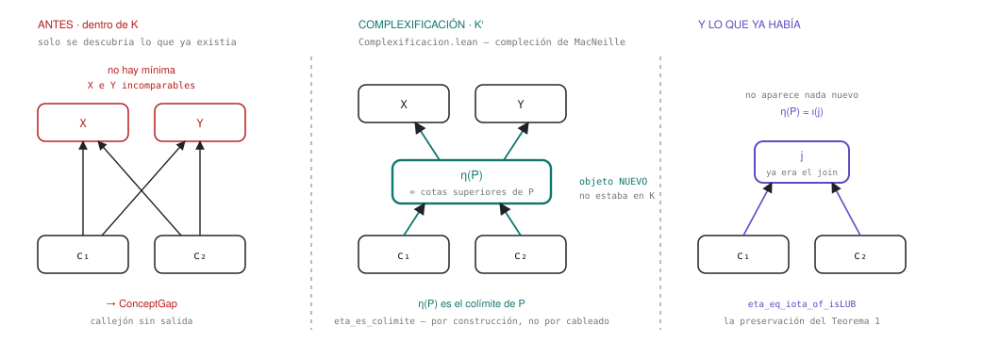
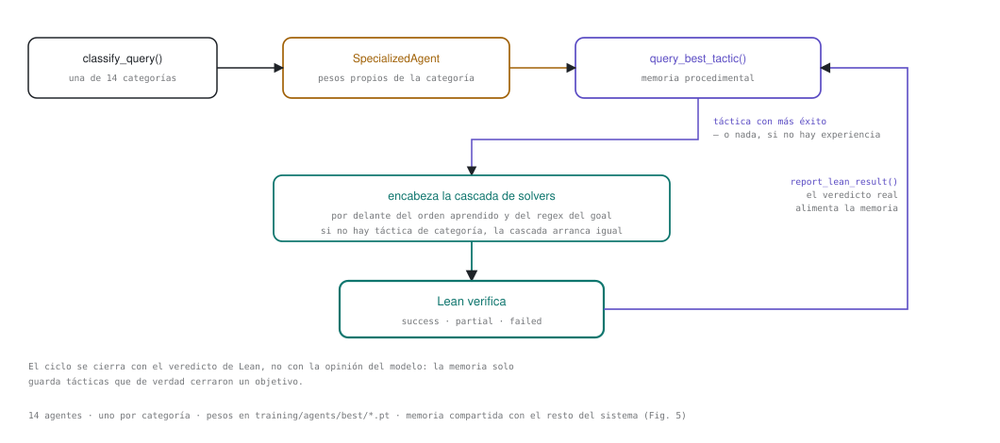
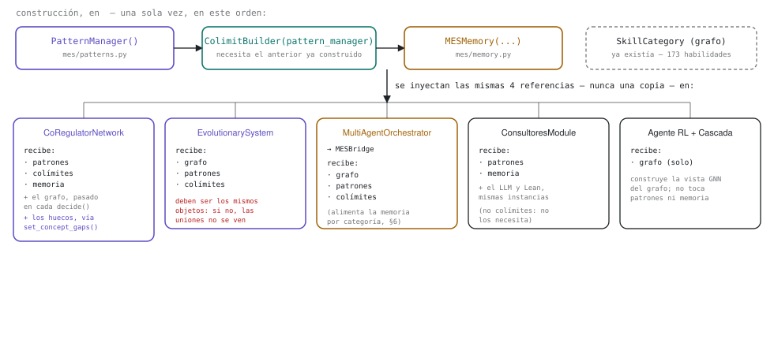
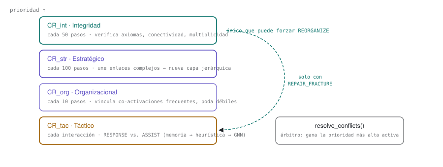
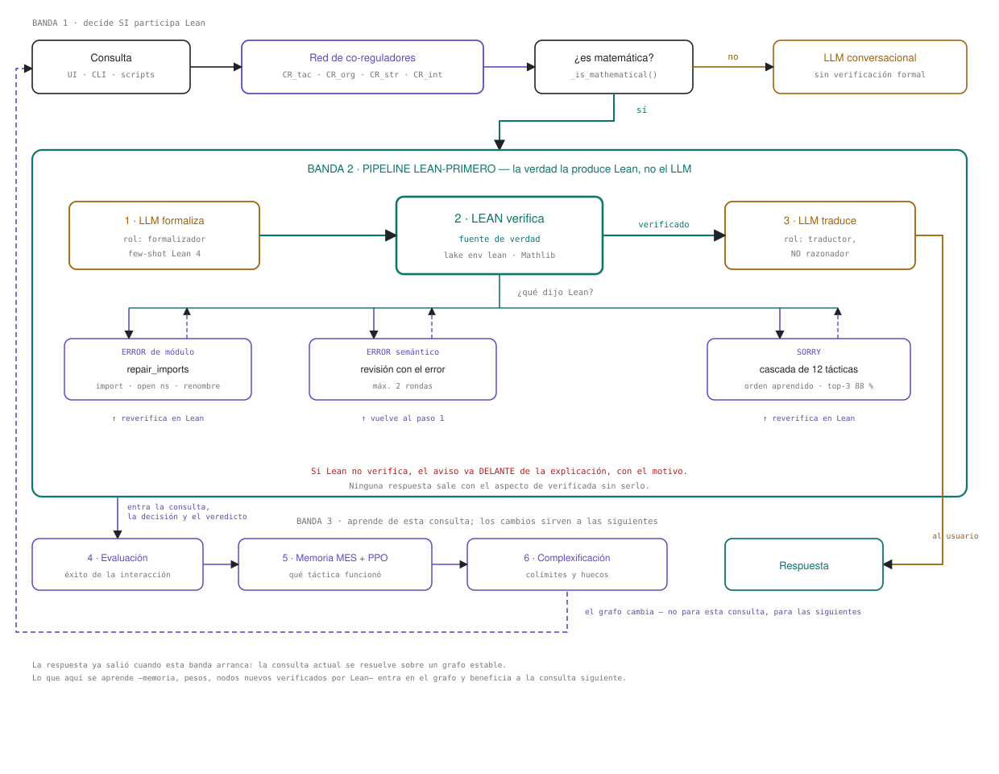
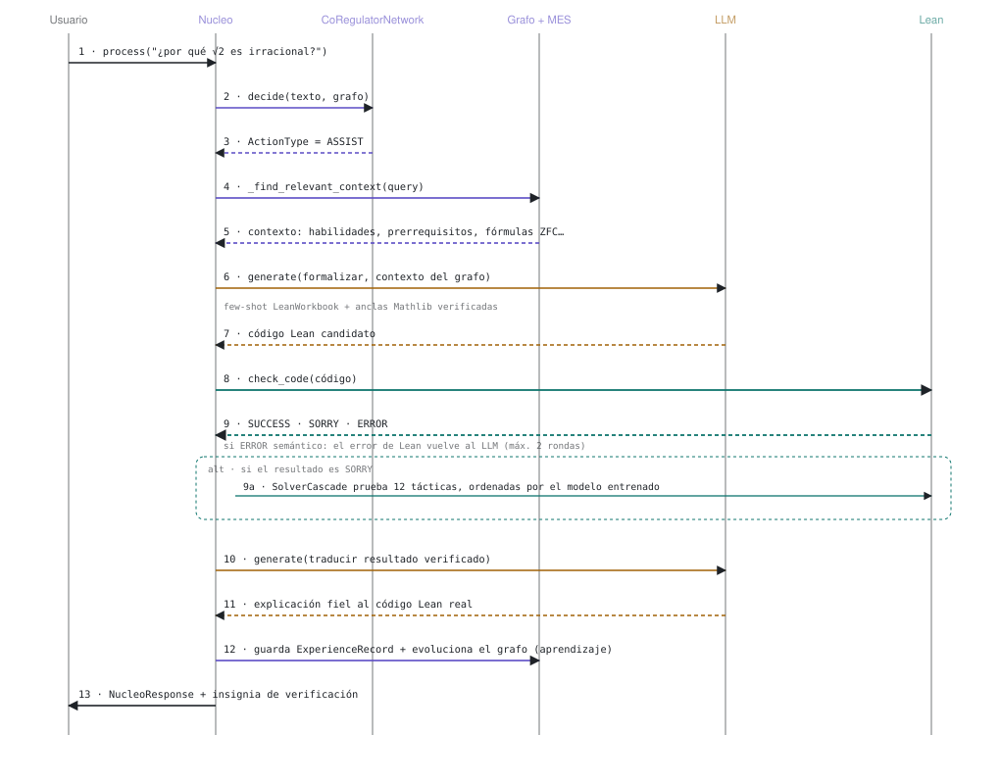

# METAMATEMÁTICO — Razonamiento Formal con Lean 4

[](https://lean-lang.org/)
[](https://python.org/)
[](#9-tests)
[](#3-el-núcleo-categórico-cómo-el-grafo-descubre-conceptos)
[](#4-sistema-multi-agente-jerarquía-de-joins)
[](#6-red-neuronal-gnn--ppo)
[](#10-datasets)
[](#11-aplicación-web)
[](LICENSE)

**Leonardo Jiménez Martínez · BIOMAT · Centro de Biomatemáticas**

---

## Índice

1. [Qué es este sistema](#1-qué-es-este-sistema)
2. [El cerebro formal: NLE + Lean 4](#2-el-cerebro-formal-nle--lean-4)
3. [El núcleo categórico: cómo el grafo descubre conceptos](#3-el-núcleo-categórico-cómo-el-grafo-descubre-conceptos)
4. [Sistema Multi-Agente: Jerarquía de Joins](#4-sistema-multi-agente-jerarquía-de-joins)
5. [Memory Evolutive Systems (MES)](#5-memory-evolutive-systems-mes)
6. [Red Neuronal GNN + PPO](#6-red-neuronal-gnn--ppo)
7. [Co-Reguladores](#7-co-reguladores)
8. [Cómo funciona: flujo completo de una consulta](#8-cómo-funciona-flujo-completo-de-una-consulta)
9. [Tests](#9-tests)
10. [Datasets](#10-datasets)
11. [Aplicación Web](#11-aplicación-web)
12. [Entrenamiento](#12-entrenamiento)
13. [Estructura del Repositorio](#13-estructura-del-repositorio)
14. [Instalación](#14-instalación)
15. [Fundamento Teórico](#15-fundamento-teórico)

> **Documentación visual completa** — [Cómo funciona NLE v7.0 por dentro](https://claude.ai/code/artifact/8907db6a-017e-41ff-a434-b1eaf4ac0631): dieciséis secciones con los nueve diagramas de este README en contexto, el registro de los dieciocho defectos que encontró formalizar, y las cifras de cada medición. Fuente en [`docs/arquitectura_nle.html`](docs/arquitectura_nle.html).

---

## 1. Qué es este sistema

**Metamatemático** es un asistente de razonamiento matemático formal. A diferencia de un LLM convencional que genera texto plausible, este sistema **verifica matemáticamente** cada respuesta antes de producirla.

El núcleo se llama **NLE v7.0 (Núcleo Lógico Evolutivo)**. Combina cuatro disciplinas en una arquitectura donde el LLM es solo la interfaz de lenguaje, mientras que el NLE y Lean 4 constituyen el **cerebro formal**:

| Componente | Rol |
|---|---|
| **NLE (Núcleo Lógico Evolutivo)** | El **cerebro**: clasifica la consulta, activa el agente especializado del área, ordena las tácticas Lean, aprende de cada interacción y coordina todo el sistema |
| **Lean 4** | El **juez formal**: verifica que la afirmación matemática sea correcta. Su veredicto es inapelable |
| **LLM** (Claude, DeepSeek, Gemini…) | La **boca**: formaliza la consulta en Lean y traduce el resultado verificado a lenguaje natural. No razona por sí solo |

> **Principio fundamental**: el LLM nunca produce matemáticas directamente. Toda respuesta matemática — sea una demostración, una definición, o una explicación conceptual — pasa por Lean antes de llegar al usuario.

---

## 2. El cerebro formal: NLE + Lean 4

### Por qué Lean como fuente de verdad

Los modelos de lenguaje pueden generar demostraciones que *suenan* correctas pero contienen errores sutiles (incluyendo errores de tipos en definiciones categóricas como la evaluación en una CCC). Lean 4 es un lenguaje con tipos dependientes que actúa como verificador: si compila sin errores, la demostración o definición es matemáticamente correcta.

**Este sistema garantiza que el LLM nunca pueda inventar matemáticas** porque su rol está arquitecturalmente limitado a:
1. Escribir código Lean (formalizar) — antes de que Lean lo verifique
2. Traducir el resultado de Lean a palabras — después de que Lean lo verifique


<p align="center">
  
</p>

<p align="center"><sub>La verificación corre local por defecto, con respaldo remoto para despliegues sin los ~6 GB de Mathlib compilado. Ambos caminos devuelven el mismo <code>LeanResult</code>: el resto del sistema no distingue cuál se usó.</sub></p>

### Dos tipos de formalización

El sistema distingue automáticamente entre preguntas que piden una *prueba* y preguntas que piden una *definición*:

| Tipo de query | Qué genera Lean | Ejemplo |
|---|---|---|
| **Prueba** | `theorem` / `lemma` con táctica | "Demuestra que √2 es irracional" |
| **Definición** | `#check` / `structure` / `class` | "¿Qué es una CCC?" |

Para definiciones, el sistema genera código como:
```lean
import Mathlib.CategoryTheory.Closed.Cartesian
#check CartesianClosed
-- eval : B^A × A → B  (no C^A — el exponencial es B^A)
#check CategoryTheory.CartesianClosed.curry
-- curry : Hom(C × A, B) ≅ Hom(C, B^A)
```

Lean confirma que estos tipos existen en Mathlib. El LLM entonces explica *exactamente lo que Lean mostró* — sin margen para inventar tipos incorrectos.

### Normalización del código antes de verificar

Un LLM que escribe Lean falla casi siempre por los mismos tres motivos, y ninguno
es matemático: inventa rutas de import, usa lemas renombrados en versiones
recientes de Mathlib, y recurre a `import Mathlib` completo. `LeanClient._normalize_code()`
corrige los tres antes de invocar al verificador:

| Problema | Qué hace el sistema |
|---|---|
| `import Mathlib` completo | Se descarta y se sustituye por un header estrecho. Medido en este proyecto: el import completo tarda **742 s** frente a los 360 s de timeout, así que **siempre** expiraba; el header estrecho compila en ~11 s. |
| Imports inexistentes | Cada `import Mathlib.*` se valida contra el árbol de fuentes real (`Mathlib/Foo/Bar.lean`) y se descarta si no existe. Ejemplos cazados: `Mathlib.GroupTheory.QuotientGroup` (lo real es `…QuotientGroup.Basic`) y `Mathlib.GroupTheory.Subgroup.Basic` (migrado a `Mathlib.Algebra.Group.Subgroup.Basic`). |
| Lemas renombrados | Tabla `_DEPRECATED_LEMMAS`. Por ejemplo `Nat.factors` → `Nat.primeFactorsList`, con sus derivados `prime_of_mem_*`, `prod_*` y `*_unique`. |
| Imports temáticos | Según palabras clave del código se añaden módulos concretos (producto interno, topología, polinomios complejos para el teorema fundamental del álgebra…). |
| `open` condicional | La notación `l ~ l'` de permutación es *scoped* al espacio `List`; se abre solo cuando el código la usa, para no introducir ambigüedades en el resto. |

El efecto medible: pruebas que antes expiraban a los 6 minutos sin devolver nada
ahora compilan con `exit 0` en ~11-19 s, o fallan con un error concreto y
diagnosticable en segundos — que es lo que la cascada de solvers puede atacar.

### SolverCascade con ranking GNN + táctica por área

Cuando la formalización contiene `sorry`, el orden de la cascada se determina en **tres etapas sucesivas**:

```
classify_query("Demuestra que todo grupo abeliano es conmutativo")
  → área: "algebra"
  → domain_default_tactic("algebra") = "ring"

Etapa 1 — GoalAnalyzer (heurística):
  prioriza domain_tactic + patrones regex del goal
  → ["ring", "rfl", "simp", "linarith", "omega", "exact?", "apply?", "aesop"]

Etapa 2 — GNNTacticRanker (embeddings aprendidos por PPO):
  goal_encoder(goal_text) → vector 256-dim
  SkillGNN.forward_nodes() → embeddings de nodo de cada táctica
  similitud coseno → reordena la permutación de la Etapa 1
  → ["ring", "omega", "simp", "rfl", "aesop", …]   ← orden final GNN

Etapa 3 — Cascada: prueba cada táctica, para en la primera exitosa
```

El ranking GNN es una **permutación** de la lista original: no añade ni elimina tácticas. La soundness es invariante al orden, probado formalmente en `CoRegulatorNetwork.lean §VII.5` (`cascade_gnn_iff_exists`).

| Área | Táctica por defecto |
|---|---|
| algebra | `ring` |
| number-theory | `norm_num` |
| logic | `tauto` |
| optimization | `linarith` |
| lean-tactics | `simp` |
| computation | `decide` |
| topology / analysis | `continuity` |

### Garantía anti-redundancia (skip_cascade)

Si `try_fill_sorry_smart` ya intentó los N solvers en orden inteligente y falló, el sistema **no repite los mismos N solvers** en `fill_sorry_with_cascade`. El flag `skip_cascade=True` hace que el segundo paso vaya directamente a la generación de candidatos LLM, evitando 2N intentos cuando N son suficientes.

---

## 3. El núcleo categórico: cómo el grafo descubre conceptos

El grafo de habilidades no es un índice: es una **categoría**, y el sistema le pregunta cosas que solo tienen sentido en ese lenguaje. La central es *¿qué concepto unifica estas áreas?* — formalmente, cuál es el **colímite** de un patrón.

### Qué descubre

Nadie declara estos conceptos. El sistema los encuentra buscando el co-cono límite entre los objetos que ya existen:

| patrón | colímite descubierto | orden |
|---|---|---|
| geometría aritmética + álgebra homológica + topología conjuntista | **espacios con haz de complejos** | **3** |
| teoría de números algebraica + teoría de cuerpos + geometría algebraica | **geometría aritmética** | 2 |
| geometría algebraica + ideales y anillos cociente | **variedades afines** | 2 |
| topología algebraica + sucesiones exactas + álgebra homológica | **categoría derivada** | 1 |
| acciones de grupo + teoría de grupos + teoría de módulos | **teoría de representaciones** | 1 |
| funtores + álgebra conmutativa | **geometría algebraica** | 1 |
| teoría de homotopía + CIC | **teoría de tipos homotópica** | 1 |

Y cuando **no** hay concepto unificador, el sistema no inventa un nodo: lo registra como hueco. Inventarlo y cablearlo hasta que cumpla la propiedad universal sería asumir la conclusión.

<p align="center">
  
</p>

### La barrera que hubo que cruzar

Durante mucho tiempo el grafo fue una **categoría delgada**: `Hom(a,b)` era un booleano — o hay flecha o no la hay. Formalizar esa situación en Lean produjo un teorema incómodo, `lub_de_lubs`: en una categoría delgada el colímite es el supremo, el supremo es asociativo, y por tanto **todo colímite iterado se aplana a un solo paso**. El orden de complejidad de Ehresmann —la emergencia, que es la razón de ser del sistema— quedaba excluido por álgebra.

No era un bug. Era un teorema en contra, y salir de él exigió abrir tres capas:

<p align="center">
  
</p>

Cerrar solo la primera no basta: con `Hom` no delgado pero el test sobre vértices, la conmutación sigue sin comprobarse. Al cerrar la segunda **cayeron cuatro de los 31 colímites registrados** — eran cotas superiores minimales sobre las que ninguna elección de flechas conmutaba, y existían solo porque la delgadez regalaba la conmutación.

### El vértice que el grafo pedía y no tenía

El resultado más interesante llegó al auditar qué es cada nodo. Cuatro descomposiciones apuntaban a `homology`, que **no es una categoría: es un funtor**, y un funtor es una arista. Pero el patrón estaba bien: componentes legítimas, forma correcta, co-cono bien formado. El grafo tenía razón en que ahí había algo, y lo había etiquetado con el nombre del invariante que ese sitio calcula, porque era la etiqueta más cercana disponible.

<p align="center">
  
</p>

El ápice correcto es el cociente del álgebra homológica módulo las sucesiones exactas — la **categoría derivada**. Con ella las tres patas pasan a ser tres cosas distintas —la inclusión de los acíclicos, el colapso, y las cadenas singulares— y ninguna es la homología: la descomposición deja de ser circular y pasa a ser un teorema.

`homology` y `cohomology` se degradan a lo que son: dos funtores `D(A) → grAb` que difieren en el signo de la graduación. Ese par de flechas paralelas es multiplicidad genuina — el mismo `Hom` con dos elementos distintos.

### Altura no es emergencia

Una distinción que costó descubrir y cambia las cifras. El sistema mide `cn`, la **altura constructiva**, tomando el máximo sobre todas las descomposiciones de un objeto. Está bien: es la altura bien fundada y es la que hace terminar la iteración.

Pero altura no es irreducibilidad. Si un objeto admite *alguna* descomposición cuyas componentes sean todas de orden 0, es un colímite simple y su orden de Ehresmann es 1 — por muchas descomposiciones altas que tenga al lado. Ahí es donde el Principio de Multiplicidad deja de ser decorativo: solo mirando todas las descomposiciones se sabe.

```
cn (máximo)          0:152 · 1:16 · 2:4 · 3:1     ← altura
orden irreducible    0:152 · 1:17 · 2:3 · 3:1     ← emergencia
```

**Objetos genuinamente emergentes: 4.** Y el máximo alcanzado es orden 3, que hereda de geometría aritmética porque esta aparece en todas sus descomposiciones. Ahí está la torre real: base → geometría aritmética → espacios con haz.

### Qué es cada nodo

Nada de lo anterior funciona sin saber qué es cada etiqueta. Mientras el grafo fue delgado, eran solo nombres; en cuanto `Hom` deja de ser un booleano hay que saber **qué flecha** y **si conmuta**. El caso que lo vuelve concreto: si `measure-theory` tiene por morfismos funciones medibles o núcleos, *cambia qué colímites existen*.

Las 172 etiquetas se auditaron una por una:

| marca | qué es | ¿vértice? | cuántas |
|---|---|---|---|
| **C** | una categoría | sí | 73 |
| **S** | subcategoría plena de otra | sí | 14 |
| **F** | un **funtor** — es arista, no vértice | no | 28 |
| **O** | un objeto dentro de una categoría | no | 4 |
| **T** | el nombre de un tema, sin objetos | no | 53 |

Las 28 marcadas **F** estaban produciendo colímites falsos: el sistema «descubría» convergencias que eran errores de tipo. No se borran — se **degradan**, repartiendo sus aristas según la dirección, que es lo que hace que no se pierda nada.

El detalle completo está en [`docs/INTERPRETACION_DEL_GRAFO.pdf`](docs/INTERPRETACION_DEL_GRAFO.pdf), generado desde `nucleo/graph/interpretacion.py` para que no pueda desfasarse.

### Respaldo formal

Cada operación categórica del Python está mapeada al teorema de Lean que la respalda, y la auditoría **valida los dos lados** — que el teorema exista y que la función exista:

```
57/58  operaciones con teorema que las respalda
    0  sorry en todo el corpus (preguntado al compilador, no con grep)
  385  teoremas en 21 archivos Lean
    1  axiom explícito (gnnRankTactics_perm) + 3 opaque
```

`collectAxioms` confirma que ninguna constante depende de `sorryAx` y que todas se apoyan solo en los tres axiomas estándar de Mathlib.

> **El límite de fondo, que ninguna cifra elimina**: Lean verifica los teoremas, no el Python. El mapeo `operación → teorema` es una afirmación bibliográfica comprobada en sus dos extremos, pero nadie ha demostrado que `find_colimit_cong` compute lo que el teorema caracteriza. Lo que sí se comprueba por test es que el grafo real cumpla las *hipótesis* de los teoremas.

---

## 4. Sistema Multi-Agente: Jerarquía de Joins

### Principio 3.1 — Separación proceso/objeto

> **El agente ENVUELVE el join — no ES el join.**

El join (colímite en la categoría thin G del grafo) es un *objeto matemático* verificado por `is_join()`. El agente es un *proceso computacional* que gestiona ese objeto. Esta distinción es fundamental:

- La propiedad universal (cota superior mínima) la satisface el nodo del grafo
- El agente selecciona tácticas, consulta la memoria MES, actualiza pesos PPO
- El reclamo matemático recae sobre el join; el agente es su envoltorio operativo

El sistema tiene **19 join-envoltorios** en 3 niveles (14 de área + 4 pilares + 1 orquestador):

```
L3: 1 Orchestrator         ← join-envoltorio del sistema completo
       ↑
L2: 14 join-envoltorios    ← uno por área matemática (algebra, topology, …)
       ↑
L1:  4 PillarAgents        ← ZFC · CatThy · Logic · TypeThy
       ↑
L0: 173 skills atómicos    ← los objetos del grafo (no agentes)
```

### La jerarquía de 4 niveles

```
L0: 173 skills atómicos (fundamentos + dominios + sub-ramas + estrategias)
    ┌────────────────────────────────────────────────────────────┐
    │  ZFC (8)  │  CatThy (8)  │  Logic (7)  │  TypeThy (8)       │  (10 L0)
    │  + 163 skills de dominio en 15 categorías, en tres niveles: │
    │      L1 campo (group-theory, real-analysis…)                │
    │      L2 sub-área (homological-algebra, measure-theory…)     │
    │      L3 sub-rama (group-homomorphisms, prime-factorization, │
    │                   galois-theory, residue-theorem…)          │
    │  + 9 tácticas Lean y 6 estrategias de prueba                │
    └────────────────────────────────────────────────────────────┘
         │  co-conos verificados por is_join()
         ▼
L1: 4 PillarAgents  — join-envoltorios de sus skills L0
    join[ZFC]    join[CatThy]    join[Logic]    join[TypeThy]

    Cada pilar inyecta morfismos (peso 0.8) en las categorías que fundamenta.
         │  morfismos L1 → L2
         ▼
L2: 14 join-envoltorios de área
    join[algebra]         join[analysis]        join[category-theory]
    join[combinatorics]   join[computation]     join[geometry]
    join[lean-tactics]    join[logic]           join[number-theory]
    join[optimization]    join[probability]     join[proof-strategies]
    join[set-theory]      join[topology]
         │  co-conos hacia L3
         ▼
L3: Orchestrator  — join-envoltorio de los 14 joins de área
```


<p align="center">
  
</p>

<p align="center"><sub>El ciclo se cierra con el veredicto de Lean, no con la opinión del modelo: la memoria solo guarda tácticas que de verdad cerraron un objetivo.</sub></p>

### Qué pilares fundamentan cada área

| Pilar L1 | Áreas L2 que nutre | Por qué |
|---|---|---|
| **ZFC** | algebra, set-theory, combinatorics, number-theory, probability, analysis | Toda la matemática clásica se construye sobre conjuntos |
| **Teoría de Categorías** | category-theory, topology, algebra, analysis | Espacios topológicos, funtores y trans. naturales son objetos categóricos |
| **Lógica (FOL+IL)** | logic, proof-strategies, lean-tactics, computation, set-theory | Las reglas de deducción dependen de la lógica formal |
| **Teoría de Tipos (Curry-Howard)** | lean-tactics, proof-strategies, computation, logic | Lean 4 está basado en CIC — las pruebas son programas |

### Cómo un join-envoltorio selecciona una táctica

`select_tactic(query)` sigue 5 pasos en cascada:

| Paso | Fuente | Descripción |
|---|---|---|
| **1** | Memoria procedimental | Hash exacto de la query: si este problema fue resuelto antes, devuelve la táctica exitosa |
| **2** | Morfismo mediador | Si otro agente resolvió una query similar con táctica compartida, está en `_mediating_memory` |
| **3** | Co-cono ponderado | Activa skills relevantes ponderados por peso de morfismo hacia el join |
| **4** | Señal de pilar (L1→L2) | Lee morfismos L1→L2, detecta keywords del pilar dominante |
| **5** | `domain_default_tactic` | Tabla estática por área: algebra→`ring`, number-theory→`norm_num`, etc. |

Ese mapeo área→táctica **también existe como morfismos del grafo**, no solo como
tabla en Python: `load_math_domains()` genera 165 morfismos de tipo `TRANSLATION`
que conectan cada skill de dominio con la táctica Lean de su área. El tipo es
TRANSLATION y no DEPENDENCY porque cruza pilares — las tácticas viven en TYPE y
los dominios en SET/CAT/LOG (Definición 4.2).

Gracias a eso, `_find_relevant_context()` puede recorrer el grafo desde la skill
que casa con la consulta hasta su táctica, e inyectar ambas en el prompt del LLM:

```
Contexto actual:
- relevant_skills: group-homomorphisms
- prerequisites: group-theory
- suggested_tactics: tactic-ring
- pillar: SET
```

Las skills declaran además términos en español e inglés (`keywords`), sin los
cuales ninguna consulta en castellano casaba con nombres de skill escritos en
inglés y el bloque de contexto salía vacío.

### MES Bridge — extensión del grafo y skills emergentes

```
join-env[algebra]  ──→┐
join-env[number-theory]→┤ MES Bridge
join-env[...]      ──→┘
                        │
              record_success(query, tactic, reward)
                        │
               ┌────────┴────────┐
               │                 │
         ProceduralMemory    PatternManager
         por área            detecta convergencia:
         (O(1) lookup)       ¿2+ agentes resolvieron
                             la misma query?
                                 │
                                 ▼
                          ColimitBuilder
                          is_join() verifica
                          propiedad universal
                          → nuevo nodo en G_t
                          (extensión del grafo)
```

---

## 5. Memory Evolutive Systems (MES)
<p align="center">
  
</p>

<p align="center"><sub>Cuando dos módulos «comparten memoria» en este sistema, literalmente apuntan al mismo objeto de Python. Si <code>EvolutionarySystem</code> recibiera su propio <code>PatternManager</code>, las uniones que proponen los co-reguladores apuntarían a patrones invisibles para él.</sub></p>


Los Memory Evolutive Systems (Ehresmann) modelan cómo el conocimiento crece manteniendo coherencia estructural.

### Los tres conceptos clave

**Patrón P: I → K**
Selección de skills relevantes para un tipo de problema. Funtor de una categoría índice I hacia el grafo K.

**join[P] — cota superior mínima verificada**
El join del patrón en la categoría thin G es el skill emergente que los sintetiza. `is_join()` verifica explícitamente la propiedad universal: todo objeto que recibe morfismos de todos los componentes del patrón se factoriza de manera única a través de join[P].

> **Nota**: el reclamo matemático es que join[P] es la cota superior mínima en la *subcategoría thin finita* G_n (~170-200 skills). No se reclama colímite en el sentido de `CategoryTheory.Limits.IsColimit` de Mathlib — esa conexión formal es trabajo futuro.

**Extensión del grafo K'**
Cuando el sistema añade join[P] con sus co-conos, el grafo pasa de K a K'. El conocimiento crece sin destruir la estructura anterior.

### Axiomas implementados y Teoremas verificados

| Axioma/Teorema | Descripción | Suite de tests |
|---|---|---|
| **8.1** Jerarquía | Skills en niveles L0 < L1 < L2 | `test_patterns.py` |
| **8.2** Multiplicidad | Un skill puede pertenecer a múltiples patrones | `test_patterns.py` |
| **8.3** Conectividad | Los patrones son conexos en el grafo | `test_patterns.py` |
| **8.4** Cobertura | Los pilares cubren todas las categorías | `test_pillar_agents.py` |
| **8.5** Emergencia | Si el patrón existe, el join existe y es único | `test_colimit_agents.py` |
| **8.6** Absorción | Nuevos skills se integran sin destruir joins previos | `test_colimit_agents.py` |
| **8.7** Mediación | Entre dos joins con solución común existe morfismo mediador único | `test_colimit_agents.py` |

### Memoria procedimental

Sembrada inicialmente con **2,371 patrones** de ProofNet y NuminaMath. Crece con cada interacción:

```python
{
    "query_text": "prove that n^2 + n is even",
    "tactic_used": "omega",
    "lean_goal": "⊢ ∀ n : ℕ, 2 ∣ n^2 + n",
    "reward": 1.0,
    "category": "number-theory"
}
```

---

## 6. Red Neuronal GNN + PPO

### Arquitectura

```
Entrada: query (texto) + grafo de skills (PyG)
         │
         ▼
  encode_query()          encode_goal()
  bag-of-kw → 256-dim     hash-seed → 256-dim
         │                      │
         └──────────┬───────────┘
                    │  cat → 768-dim → fusion(256)
                    ▼
  SkillGNN (GATConv × 3, edge_attr, hidden_dim=256):
    input_proj  9 → 256
    GATConv 1   256 × 4 heads   ~  66,560 params
    GATConv 2   256 × 4 heads   ~ 262,144 params
    GATConv 3   256 × 4 heads   ~ 262,144 params
    forward()         → global_mean_pool → graph_emb (256)
    forward_nodes()   → per-node emb (N × 256)   ← usado por GNNTacticRanker
  ActorCriticNetwork:
    actor 256→3 · critic 256→1
    ▼
  Acción (routing):  ASSIST | RESPOND | REORGANIZE

  GNNTacticRanker (selección de tácticas dentro de Lean):
    goal_encoder(goal_text) → 256-dim
    SkillGNN.forward_nodes()[tactic_idx] → 256-dim por táctica
    cosine_similarity(goal_emb, tactic_emb) → score ∈ [-1, 1]
    sorted(solvers, key=score) → permutación GNN-óptima
```

**Total: 546,820 parámetros — 2.2 MB**

### Resultados de entrenamiento

**Fase 1 — Supervisado:**

| Métrica | Resultado |
|---|---|
| Dataset | 52,237 train · 6,552 val · 12,874 test |
| train_acc / val_acc / test_acc | **100% / 100% / 100%** |

**Fase 2 — PPO con recompensas reales de Lean** (5 épocas, RTX 3050):

| Época | Loss | Avg Reward |
|---|---|---|
| 1 | 0.0746 | 0.573 |
| 5 | 0.0172 | **0.578** |

El reward ~0.57 refleja la distribución real: ~70% aritmética (`norm_num` +1.0) y ~30% álgebra abstracta (+0.5).

### Dos usos del GNN entrenado

| Uso | Entrada | Salida |
|---|---|---|
| **Routing** (`select_action`) | grafo + query_emb + goal_emb | ASSIST / RESPOND / REORGANIZE |
| **Tactic ranking** (`GNNTacticRanker.rank`) | goal_text + lista de solvers | permutación ordenada por similitud coseno |

El segundo uso no requiere entrenamiento adicional: usa `forward_nodes()` del GNN ya entrenado con PPO. Los embeddings de nodo de `tactic-ring`, `tactic-omega`, etc. codifican su rol estructural en el grafo (conectados a skills de álgebra, aritmética…), lo que sirve naturalmente para rankear tácticas por relevancia al goal.

### Aprendizaje vivo

Cada interacción actualiza el sistema:
```
Consulta → join-env selecciona táctica → Lean verifica
         → record_result(reward)
         → memoria procedimental actualizada
         → Transition → buffer PPO
         → cada 10 interacciones: agent.update() + save weights
         → GNNTacticRanker.invalidate_cache()   ← los nuevos pesos mejoran el ranking
```

---

## 7. Co-Reguladores
<p align="center">
  
</p>

<p align="center"><sub>El orden es fijo (Axioma 9.5): integridad &gt; estratégico &gt; organizacional &gt; táctico. Casi siempre gana el táctico porque es el único que corre en cada interacción.</sub></p>


4 co-reguladores controlan el flujo antes de llegar a los join-envoltorios:

| Co-regulador | Prioridad (Axioma 9.5) | Función |
|---|---|---|
| **TACTICAL (CR_tac)** | 0 (base) | Clasifica la consulta: ¿pipeline Lean-primero o respuesta directa? |
| **ORGANIZATIONAL (CR_org)** | 1 | Organiza secuencia de tácticas en demostraciones largas |
| **STRATEGIC (CR_str)** | 2 | Decide estrategia global: backward reasoning, casos, inducción |
| **INTEGRATIVE (CR_int)** | 3 (máxima) | Integra sub-demostraciones; su voto prevalece sobre los demás |

**Propiedades formalmente probadas** en [`MetamathProver/CategoryFoundations/CoRegulatorNetwork.lean`](MetamathProver/CategoryFoundations/CoRegulatorNetwork.lean) (sin `sorry`):

| Teorema | Qué garantiza |
|---|---|
| `integrity_max_priority` | CR_int domina a todos los demás (Axioma 9.5) |
| `globalDecision_deterministic` | El protocolo de decisión es total y determinista |
| `integrity_dominates` | Si CR_int propone una acción, esa ES la decisión global |
| `routing_dichotomy` | El routing produce ASSIST o RESPOND, nunca REORGANIZE |
| `EEquiv_is_equivalence` | La E-equivalencia de clasificadores es una relación de equivalencia |
| `cascade_gnn_iff_exists` | La cascada GNN-ordenada es sound (misma garantía que orden fijo) |
| `pipeline_gnn_verified_implies_proof` | `Verified` con GNN ranking → existe táctica que cierra el goal |

---

## 8. Cómo funciona: flujo completo de una consulta


<p align="center">
  
</p>

<p align="center"><sub>El recorrido completo. La tercera banda arranca <em>después</em> de que la respuesta salió: la consulta actual se resuelve siempre sobre un grafo estable, y lo que aprende beneficia a la siguiente.</sub></p>

### El principio fundamental

> **NLE + Lean = cerebro. LLM = boca.**

El LLM formaliza (antes de Lean) y traduce (después de Lean). Nunca razona por sí solo. Esto elimina la posibilidad de que el LLM alucine definiciones o tipos incorrectos, porque la respuesta final debe ser consistente con lo que Lean verificó.

```
 ┌──────────────────────────────────────────────────────────────────────┐
 │  USUARIO: "¿Qué es una CCC?" / "Demuestra que √2 es irracional"      │
 └──────────────────────┬───────────────────────────────────────────────┘
                        │
                        ▼
 ┌──────────────────────────────────────────────────────────────────────┐
 │  PASO 1 — ¿Es matemática?                                            │
 │  80+ palabras clave, símbolos Unicode (∀∃∈ℝ), LaTeX, acentos        │
 │  Funciona en español e inglés.                                       │
 │  NO → respuesta directa LLM (saludo, pregunta general)               │
 │  SÍ → Paso 2                                                         │
 └──────────────────────┬───────────────────────────────────────────────┘
                        │
                        ▼
 ┌──────────────────────────────────────────────────────────────────────┐
 │  PASO 1b — ¿Es una demostración EXPLÍCITAMENTE geométrica/visual?    │
 │  ("demostración geométrica", "al estilo de Euclides", etc.)          │
 │  SÍ → respuesta educativa enriquecida (único bypass de Lean)         │
 │  NO → pipeline NLE+Lean (pasos 2–8)                                  │
 └──────────────────────┬───────────────────────────────────────────────┘
                        │
                        ▼
 ┌──────────────────────────────────────────────────────────────────────┐
 │  PASO 2 — Co-Reguladores votan la estrategia                         │
 │  CR_tac · CR_org · CR_str · CR_int → acción: ASSIST o RESPONSE       │
 └──────────────────────┬───────────────────────────────────────────────┘
                        │
                        ▼
 ┌──────────────────────────────────────────────────────────────────────┐
 │  PASO 3 — Clasificación de área y join-envoltorio especializado      │
 │                                                                      │
 │  classify_query(text) → área (14 categorías, español + inglés)       │
 │  domain_default_tactic(área) → táctica prioritaria para SolverCascade│
 │                                                                      │
 │  "¿Qué es una CCC?"          → area: "category-theory"              │
 │  "Demuestra √2 irracional"   → area: "number-theory"                │
 │  "Minimizar función convexa" → area: "optimization"                  │
 └──────────────────────┬───────────────────────────────────────────────┘
                        │
                        ▼
 ┌──────────────────────────────────────────────────────────────────────┐
 │  PASO 4 — ¿Prueba o Definición?                                      │
 │                                                                      │
 │  "qué es", "define", "explícame" → path DEFINITIONAL                 │
 │  "demuestra", "prueba", "verifica" → path PRUEBA                     │
 └──────────┬───────────────────────────┬─────────────────────────────-┘
            │ DEFINITIONAL              │ PRUEBA
            ▼                           ▼
 ┌────────────────────┐     ┌───────────────────────────────────────────┐
 │  LLM genera:       │     │  LLM genera theorem/lemma con sorry       │
 │  #check / struct.  │     │  Guardia anti-tautología activa           │
 │  de Mathlib        │     │  Ejemplos few-shot de miniF2F             │
 │  Refs hardcoded:   │     │  Refs hardcoded de teoremas clásicos      │
 │  • CartesianClosed │     │                                           │
 │  • eval:B^A×A→B    │     │                                           │
 │  • Functor, Group… │     │                                           │
 └──────────┬─────────┘     └──────────────────┬────────────────────────┘
            │                                  │
            └──────────────┬───────────────────┘
                           ▼
 ┌──────────────────────────────────────────────────────────────────────┐
 │  PASO 5 — Lean 4 verifica el código                                  │
 │                                                                      │
 │  ✅ ÉXITO (SUCCESS)  → confianza 95%                                 │
 │  ⚠  SORRY           → SolverCascade con domain_tactic primero       │
 │  ❌ ERROR            → diagnóstico estructurado de tipo de error     │
 │  ⏱ TIMEOUT          → mensaje informativo + invitación a reintentar  │
 └──────────────────────┬───────────────────────────────────────────────┘
                        │
                        ▼
 ┌──────────────────────────────────────────────────────────────────────┐
 │  PASO 5b — SolverCascade GNN-ordenada (solo si hay sorry)            │
 │                                                                      │
 │  try_fill_sorry_smart(goal_text, domain_tactic=táctica_del_área)    │
 │  Etapa 1 GoalAnalyzer: [táctica_área, …patrones regex…]             │
 │  Etapa 2 GNNTacticRanker: reordena por cosine(goal_emb, tactic_emb) │
 │  Garantía formal: permutación → soundness preservada                 │
 │  Si falla → fill_sorry_with_cascade(skip_cascade=True)              │
 │           → candidatos LLM (sin repetir los mismos N solvers)       │
 └──────────────────────┬───────────────────────────────────────────────┘
                        │
                        ▼
 ┌──────────────────────────────────────────────────────────────────────┐
 │  PASO 6 — LLM traduce lo que Lean verificó                           │
 │                                                                      │
 │  Para PRUEBA:                     Para DEFINICIÓN:                   │
 │  ## ¿Qué dice este resultado?     ## Definición formal               │
 │  ## ¿Cómo lo demuestra Lean?      ## Intuición                       │
 │  ## ¿Por qué es correcto?         ## Propiedades clave               │
 │                                   ## En Lean / Mathlib               │
 │                                                                      │
 │  CRÍTICO: la explicación debe ser CONSISTENTE con los tipos          │
 │  del código Lean. Si Lean dice eval:B^A×A→B, la explicación         │
 │  dice eval:B^A×A→B — no puede inventar otro tipo.                   │
 └──────────────────────┬───────────────────────────────────────────────┘
                        │
                        ▼
 ┌──────────────────────────────────────────────────────────────────────┐
 │  RESPUESTA AL USUARIO                                                │
 │                                                                      │
 │  [Explicación en lenguaje natural, consistente con Lean]             │
 │  ─────────────────────────────────────────────────────               │
 │  Lean 4 ✓ — definición verificada formalmente · área: category-theory│
 │                                                                      │
 │  ```lean                                                             │
 │  import Mathlib.CategoryTheory.Closed.Cartesian                      │
 │  #check CartesianClosed  -- eval : B^A × A → B                      │
 │  ```                                                                 │
 └──────────────────────┬───────────────────────────────────────────────┘
                        │
                        ▼
 ┌──────────────────────────────────────────────────────────────────────┐
 │  PASO 7 — Aprendizaje y memoria MES                                  │
 │  Resultado → reward → PPO buffer → memory.json                       │
 │  Los pesos se actualizan cada 10 interacciones                       │
 └──────────────────────────────────────────────────────────────────────┘
```

---


<p align="center">
  
</p>

<p align="center"><sub>Trece pasos, dos llamadas al LLM y una verificación real de Lean en medio. El grafo se toca dos veces: se lee para dar contexto <em>antes</em> de formalizar, y se escribe para aprender <em>después</em> de responder.</sub></p>

---

## 9. Tests

```bash
python -m pytest tests/ -o "addopts=" -v
```

**740 tests en 35 suites**. Las mayores, por lo que verifican:

| Suite | Tests | Qué verifica |
|---|---|---|
| `test_interpretacion.py` | 61 | Las 172 etiquetas: qué es categoría, qué es funtor, qué se degrada |
| `test_no_delgado.py` | 49 | La salida de la delgadez: `Hom` no booleano, congruencia, co-conos |
| `test_lean_integration.py` | 48 | Cliente Lean 4, cascada de solvers, análisis de `sorry` |
| `test_complexity_order.py` | 35 | Orden `cn`, orden irreducible, jerarquía emergente |
| `test_math_domains.py` | 32 | Las 163 definiciones de dominio en 15 categorías |
| `test_domain_tactic_pipeline.py` | 30 | `_math_via_lean` → táctica de dominio → cascada |
| `test_hierarchy_integration.py` | 27 | Integración jerarquía ↔ razonamiento |
| `test_colimits.py` | 26 | Propiedad universal, co-conos, morfismo mediador |
| `test_formal_properties.py` | 26 | Axiomas 8.1–8.4, Teoremas 8.5–8.7 |
| `test_ppo.py` | 25 | PPO update, GAE, clipping |
| `test_complexificacion.py` | 19 | El paso K → K′, preservación y retirada selectiva |
| `test_emergence.py` | 18 | Enlaces simples/complejos, ligaduras que descubren y no fabrican |
| `test_funtor.py` | 11 | El funtor cociente π: Skills → Agentes |
| `test_arranque_real.py` | 6 | Lo que solo aparece al **encender** el sistema entero |
| + 21 suites más | 303 | Memoria, co-reguladores, pilares, GNN, CLI, evolución, guardianes |

Cuatro suites son **guardianes**, y existen porque el proyecto ya se quemó con lo que vigilan:

- `test_ui_coherencia.py` — las cifras escritas a mano que envejecen en silencio. La interfaz llegó a anunciar 76 skills con 172 cargados, y 124.420 parámetros cuando la red tiene 546.820.
- `test_respaldo_lean.py` — que el mapeo `operación → teorema` no retroceda ni nombre cosas inexistentes.
- `test_taxonomia_coherente.py` — que las categorías del grafo no se contradigan entre sí.
- `test_arranque_real.py` — el más reciente. Los tres defectos que fija pasaron desapercibidos a 681 tests que verificaban cada módulo por separado: el grafo crecía al usarlo, el clasificador no reconocía «¿cuánto es 2 + 2?», y la multiplicidad que Lean certificó no llegaba al runtime.

Los tests del pipeline de tácticas (`test_domain_tactic_pipeline.py`) verifican sin Lean instalado usando mocks del `LeanClient`.

---

## 10. Datasets

El sistema integra **5.4M+ ejemplos matemáticos** de datasets públicos:

| Dataset | Ejemplos | Categorías |
|---|---|---|
| **OpenMathReasoning** | 3,201,061 | algebra, number-theory, analysis, competition math |
| **NuminaMath** | 859,494 | algebra, combinatorics, number-theory, geometry |
| **MetaMathQA** | 395,000 | algebra, arithmetic |
| **Autoformalization** | 327,000 | lean-tactics (pares NL ↔ Lean) |
| **OrcaMath** | 200,000 | algebra, arithmetic |
| **OpenR1Math** | 93,000 | proof-strategies |
| **LeanWorkbook + Proofs** | 54,000 | lean-tactics (pruebas Lean reales) |
| **BigBench Formal Fallacies** | 14,200 | logic |
| **HendrycksMath** | 12,500 | algebra, calculus, statistics |
| **OmniMath** | 4,400 | IMO, APMO, Putnam |
| **ProofNet** | 371 | proof-strategies, lean-tactics |
| **GSM8K + MATH + miniF2F** | ~21,000 | aritmética, álgebra |

---

## 11. Aplicación Web

La interfaz Streamlit permite usar el sistema sin escribir código:

```bash
pip install -r requirements.txt

# Windows: necesario para símbolos Unicode matemáticos
PYTHONIOENCODING=utf-8 streamlit run app.py
```

Abre en `http://localhost:8501` · Demo en Streamlit Cloud disponible.

### Proveedores LLM soportados

| Proveedor | Modelos | Costo |
|---|---|---|
| **Anthropic** | Claude Haiku 4.5, Claude Sonnet 4.6 | De pago |
| **DeepSeek** | deepseek-chat (V3), deepseek-reasoner (R1) | De pago (muy barato) |
| **Google AI Studio** | Gemini 2.0 Flash, Gemini 1.5 Pro | Gratis (con cuota) |
| **Groq** | Llama 3.3 70B, Mixtral 8x7B | Gratis |
| **Demo** | Contenido matemático local | Sin key |

> DeepSeek usa la API compatible con OpenAI (`pip install openai`) con `base_url=https://api.deepseek.com`. El modelo R1 (`deepseek-reasoner`) no acepta parámetro `temperature` — el sistema lo omite automáticamente.

### Funcionalidades de la interfaz

| Funcionalidad | Descripción |
|---|---|
| **Chat multi-turno** | Conversación continua. El contexto se sincroniza con la memoria interna del NLE. |
| **Adjuntar archivos (📎)** | Soporta `.txt`, `.tex`, `.pdf`. El archivo **persiste** en sesión: las consultas de seguimiento lo usan automáticamente sin necesidad de volver a subirlo. |
| **Visualizaciones** | Grafo de skills, embeddings t-SNE/PCA, diagrama MES, traza de prueba, árbol de agentes. |
| **Verificador Lean 4** | Editor Lean 4 interactivo con verificación en tiempo real. |
| **Consultores Avanzados** | Genera N artefactos matemáticos verificables: `.lean`, skeletons de demostración, scripts Python, puentes de verificación. Cada candidato se verifica en Lean y se rankea por puntuación. |
| **Ejemplos rápidos** | Botones preconfigurados: √2 irracional, Lema de Yoneda, Lean 4 directo, Curry-Howard. |
| **Estado de Lean 4** | El sidebar muestra el estado del warmup: ⏳ cargando Mathlib / 🔥 listo. |

### Pestaña de Visualizaciones

| Pestaña | Qué muestra |
|---|---|
| **Grafo de Skills** | 172 nodos y 553 morfismos. Skills activados: amarillo. Dependencias: morado. Tácticas: verde. |
| **Embeddings** | t-SNE/PCA de los 173 skills (320 dims). Estrellas naranjas = tus queries del chat. |
| **Extensión del Grafo** | Patrón P, join[P] verificado por `is_join()` y la estructura K' extendida. |
| **Pipeline** | Diagrama de flujo del sistema. |
| **Agentes** | Jerarquía de 19 join-envoltorios, métricas F1/F2, pesos cargados. |

---

## 12. Entrenamiento

### Etapa A — Balancear datasets

```bash
python scripts/balance_datasets.py --dry-run    # estadísticas sin escribir
python scripts/balance_datasets.py --target 5000
```

### Etapa B — Entrenar los 14 join-envoltorios especializados

```bash
python scripts/train_multiagent.py --epochs 5
python scripts/train_multiagent.py --categories algebra number-theory logic --epochs 10
python scripts/train_multiagent.py --with-lean --ppo-epochs 3
```

### Etapa C — Entrenar el GNN+PPO global

```bash
python scripts/prepare_training_data.py

# Fase 1: supervisado (~20 min en RTX 3050)
python scripts/train_gnn_ppo.py --epochs 10 --batch-size 256

# Fase 2: PPO con Lean real
python scripts/train_gnn_ppo.py --resume --with-lean --lean-samples 300 --epochs 0 --ppo-epochs 5
```

### Etapa D — Sembrar la memoria procedimental

```bash
python scripts/seed_from_datasets.py   # 2,371 patrones → data/memory.json
```

---

## 13. Estructura del Repositorio

```
Metamatematico/
│
├── app.py                         # App Streamlit — interfaz de chat
├── pages/
│   ├── 1_Visualizaciones.py       # Grafos, embeddings, MES, traza de prueba
│   ├── 2_Verificador.py           # Verificador Lean 4 interactivo
│   ├── 3_Instalar_Lean.py         # Guía de instalación Lean 4 con verificación en vivo
│   └── 4_Consultores_Avanzados.py # Módulo experto: N artefactos .lean verificados + reranker
│
├── nucleo/                        # Núcleo Lógico Evolutivo (~13,500 LOC)
│   ├── core.py                    # Orquestador: Lean-first + multi-agente + domain_tactic + consultores
│   ├── config.py                  # Configuración centralizada
│   │
│   ├── multi_agent/               # Sistema multi-agente
│   │   ├── orchestrator.py        # MultiAgentOrchestrator (L3)
│   │   ├── colimit_agents.py      # join-envoltorios L2 + domain_default_tactic()
│   │   ├── pillar_agents.py       # PillarAgent (L1)
│   │   ├── specialized_agent.py   # SpecializedAgent: GNN+PPO + classify_query() ES+EN
│   │   └── mes_bridge.py          # MESBridge: convergencia → extensión del grafo
│   │
│   ├── graph/                     # Grafo categórico de skills
│   │   ├── category.py            # SkillCategory: nodos, morfismos, Hom no delgado
│   │   ├── complexity.py          # cn, orden irreducible, find_colimit_cong
│   │   ├── complexificacion.py    # El paso K → K′, con preservación selectiva
│   │   ├── no_delgado.py          # Congruencia, co-conos, morfismos certificados
│   │   ├── interpretacion.py      # Qué es cada nodo: las 172 etiquetas
│   │   ├── functor.py             # El funtor cociente π: Skills → Agentes
│   │   └── evolution.py           # Extensión del grafo, snapshots, functores
│   │
│   ├── mes/                       # Memory Evolutive Systems
│   │   ├── patterns.py            # Patrones, is_join(), propiedad universal verificada
│   │   ├── memory.py              # MES Memory: patrones procedimentales, snapshots
│   │   └── co_regulators.py       # 4 Co-reguladores activos
│   │
│   ├── rl/                        # Aprendizaje por refuerzo
│   │   ├── agent.py               # NucleoAgent: PPO + GAE + memoria procedimental
│   │   ├── gnn.py                 # SkillGNN: 3× GATConv + graph_to_pyg()
│   │   ├── networks.py            # ActorCriticNetwork (546K params)
│   │   └── mdp.py                 # MDP matemático
│   │
│   ├── lean/                      # Verificación formal Lean 4
│   │   ├── client.py              # LeanClient (subprocess, UTF-8, timeout)
│   │   ├── solver_cascade.py      # GoalAnalyzer + SolverCascade + try_fill_sorry_smart
│   │   ├── sorry_filler.py        # SorryFiller con skip_cascade
│   │   └── sorry_analyzer.py      # Análisis estructurado de pruebas incompletas
│   │
│   ├── llm/                       # Cliente LLM multi-proveedor
│   │   └── client.py              # Anthropic / Google / Groq / DeepSeek / Demo
│   │
│   ├── pillars/                   # Skills L0 fundacionales
│   │   ├── zfc.py                 # 8 skills ZFC
│   │   ├── category_theory.py     # 8 skills CatThy
│   │   ├── logic.py               # 7 skills Logic
│   │   ├── type_theory.py         # 8 skills TypeThy
│   │   └── math_domains.py        # 163 skills L1-L3 en 15 categorías
│   │
│   ├── consultores/               # Módulo experto opcional
│   │   ├── artifacts.py           # Dataclasses: Candidate, CandidateMetrics, ConsultingResult, RequestType
│   │   ├── master_prompt.py       # Prompt maestro con bloques %%MARKER%% parseables
│   │   ├── reranker.py            # score_and_rank(): Lean score + completitud + complejidad
│   │   └── orchestrator.py        # ConsultoresModule.process(): N candidatos → Lean → rerank
│   │
│   └── eval/
│       └── math_evaluator.py      # \boxed{} extraction, tolerancia numérica, sympy
│
├── MetamathProver/                # Pruebas Lean 4 verificadas
│   ├── ColimitVerifier.lean       # Cierre transitivo, soundness, completeness
│   └── JoinColimit.lean           # IsJoin ↔ co-cono + prop. universal, 0 sorry
│
├── scripts/                       # Entrenamiento y utilidades
├── data/                          # Datos generados (lean_examples.json versionado)
├── tests/                         # 740 tests en 35 suites
└── docs/                          # Paper NLE v7.0, arquitectura, diagramas
    ├── arquitectura_nle.html      # Fuente del documento visual completo
    ├── INTERPRETACION_DEL_GRAFO.pdf  # Generado desde interpretacion.py
    └── img/                       # Los 9 diagramas de este README, en SVG
```

---

## 14. Instalación

```bash
git clone https://github.com/metamatematico/Metamatematico---Razonamiento-Formal-con-Lean.git
cd Metamatematico---Razonamiento-Formal-con-Lean

conda create -n metamat python=3.10
conda activate metamat
pip install -r requirements.txt
```

### Lean 4 + Mathlib (necesario para verificación real)

```bash
curl https://elan.lean-lang.org/elan-init.sh -sSf | sh
lake update   # descarga Mathlib (~20-30 min la primera vez)
```

> Sin Lean instalado, el sistema funciona con el pipeline completo excepto la verificación formal — el badge mostrará `Lean 4 ↯` en lugar de `Lean 4 ✓`.

#### Nota sobre cold-start en Windows

En Windows, la primera carga de Mathlib tras reiniciar el sistema tarda **~12 minutos** (lee ~5.3 GB de archivos `.olean` del disco). El sistema mitiga esto con un proceso de calentamiento automático (_warmup_) que arranca en background al iniciar la app. Una vez que los `.olean` están en caché del sistema operativo, las verificaciones posteriores toman **< 30 segundos**.

El sidebar muestra el estado en tiempo real:
- `⏳ Lean cargando Mathlib…` — warmup en progreso; las consultas de Claude funcionan con normalidad
- `🔥 Lean 4 listo` — verificación formal disponible a plena velocidad

Si una verificación llega antes de que el warmup complete, el sistema responde con el badge `⏱ timeout` e invita a reintentar (la segunda llamada será rápida).

### Dependencias principales

```
torch>=2.0              # GNN + PPO
torch-geometric>=2.4    # GATConv, PyG
networkx>=3.0           # Grafo categórico
streamlit>=1.40         # Interfaz web
openai>=1.0             # DeepSeek (API compatible) + fallback
anthropic               # Anthropic Claude
numpy, scikit-learn, sympy
```

### Lanzar

```bash
# Linux / macOS
PYTHONIOENCODING=utf-8 streamlit run app.py   # interfaz web
python -m nucleo chat                          # CLI interactivo
```

```powershell
# Windows (PowerShell)
$env:PYTHONIOENCODING = "utf-8"
streamlit run app.py --server.port 8501        # interfaz web en http://localhost:8501
```

La API key del proveedor LLM puede configurarse mediante variable de entorno (`ANTHROPIC_API_KEY`, `GOOGLE_API_KEY`, `GROQ_API_KEY`, `DEEPSEEK_API_KEY`) o introducirse directamente en el sidebar de la aplicación. Ambas vías son equivalentes.

---

## 15. Fundamento Teórico

El NLE v7.0 está basado en el artículo **"Núcleo Lógico Evolutivo v7.0 — Memory Evolutive Systems y Razonamiento Formal"** (Jiménez Martínez, BIOMAT 2025), disponible en `docs/NLE_v7_PaperNN.pdf`.

### La intuición central

Un matemático experto no reapende álgebra de cero cada vez que resuelve un problema. Su conocimiento está organizado en **competencias** (skills) que se activan según el contexto, y cuando resuelve un problema nuevo, sintetiza competencias previas en una competencia emergente. Los Memory Evolutive Systems formalizan esta estructura.

La jerarquía L0→L1→L2→L3 refleja exactamente eso:
- **L0** — axiomas (ZFC, lógica, tipos, categorías): el conocimiento más fundamental
- **L1** — pilares: síntesis de los axiomas de cada fundamento
- **L2** — áreas matemáticas: síntesis de skills de dominio + señales de pilares
- **L3** — sistema completo: punto de entrada único

Cada nivel es el join del nivel anterior en el grafo. Pero la implementación literal de esa frase resultó tener un problema, y encontrarlo cambió el sistema: mientras el grafo fue una **categoría delgada**, `lub_de_lubs` demuestra que iterar joins nunca produce orden de complejidad ≥ 2 — el supremo es asociativo y todo se aplana. La complexificación de Ehresmann exige salir de la delgadez, y eso es lo que hace hoy el sistema. Ver la [sección 3](#3-el-núcleo-categórico-cómo-el-grafo-descubre-conceptos).

### Por qué teoría de categorías

La teoría de categorías es el lenguaje natural de las matemáticas modernas: expresa relaciones entre estructuras con la misma precisión que las estructuras mismas. Usar categorías para organizar el conocimiento matemático es coherente con el dominio que el sistema maneja — no es una elección arbitraria, sino la misma formalización que los matemáticos usan para relacionar álgebra, topología, lógica y computación entre sí.

### Limitaciones honestas

| Reclamo | Estado |
|---|---|
| El grafo es una categoría delgada | ✗ **ya no** — 5 de 387 pares tienen `Hom` con más de un elemento, cada uno con el teorema de Lean que lo certifica |
| Un colímite exige co-cono, no solo alcanzabilidad | ✓ `find_colimit_cong` exige una elección de flechas que conmute. Al imponerlo cayeron 4 de 31 colímites que solo existían por la delgadez |
| El sistema alcanza orden de Ehresmann ≥ 2 | ✓ 4 objetos irreducibles, máximo alcanzado **3** — medido con `orden_irreducible()`, que toma el mínimo sobre las descomposiciones y no el máximo |
| La complexificación produce emergencia | ✗ **no**, y conviene decirlo: `η(P)` se inserta justo encima de las componentes, luego su orden es `1 + max(componentes)`. Cierra huecos; los conceptos siguen viniendo de la matemática |
| join[P] es cota superior mínima en G_n | ✓ verificado por `is_join()` en Python |
| Conexión formal con `CategoryTheory.Limits.IsColimit` de Mathlib | ✓ **Cerrado** — `isJoin_iff_nonempty_isColimit` en `IsColimitBridge.lean` (sin sorry): `IsJoin S j ↔ ∃ hub, Nonempty (IsColimit (joinCocone S j hub))` en la categoría thin del preorden de reachability |
| GNN usada para selección de tácticas dentro de Lean | ✓ `GNNTacticRanker` usa `SkillGNN.forward_nodes()` + `goal_encoder` del modelo PPO-entrenado; ranking por similitud coseno, integrado en `try_fill_sorry_smart`. Prueba formal: `cascade_gnn_iff_exists` en `CoRegulatorNetwork.lean §VII.5` (sin sorry) |
| Co-reguladores: analogías Python del formalismo MES categórico | ✓ Prueba formal completa en `CoRegulatorNetwork.lean` (Axioma 9.5, orden lineal total, decisión determinista, E-equivalencia, cascada, pipeline GNN; sin sorry) |

---

**Leonardo Jiménez Martínez · BIOMAT · Centro de Biomatemáticas · 2025**
