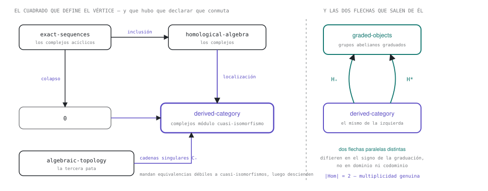

# METAMATEMÁTICO — Razonamiento Formal con Lean 4

[](https://lean-lang.org/)
[](https://python.org/)
[](#6-tests)
[](#5-lo-que-está-medido)
[](#4-el-vocabulario-verificado)
[](#7-lo-que-el-grafo-descubre-solo)
[](LICENSE)

**Leonardo Jiménez Martínez · BIOMAT · Centro de Biomatemáticas**

Una IA matemática que **no confía en el modelo de lenguaje para decidir si algo es cierto**. El LLM formaliza en Lean 4, el kernel verifica, y solo entonces se traduce el resultado. Un grafo categórico de conceptos interviene en dos puntos de esa cadena — y en ninguno decide qué es verdad.

> **Documentación visual completa** — [Metamatemático por dentro](https://claude.ai/code/artifact/8907db6a-017e-41ff-a434-b1eaf4ac0631): el flujo en detalle, el registro de defectos que encontró medir, y de dónde sale cada cifra. Fuente en [`docs/arquitectura_nle.html`](docs/arquitectura_nle.html).

---

## Índice

1. [El flujo, de la entrada a la salida](#1-el-flujo-de-la-entrada-a-la-salida)
2. [Lean decide, y sus seis veredictos](#2-lean-decide-y-sus-seis-veredictos)
3. [El grafo: qué es y qué hace](#3-el-grafo-qué-es-y-qué-hace)
4. [El vocabulario verificado](#4-el-vocabulario-verificado)
5. [Lo que está medido](#5-lo-que-está-medido)
6. [Tests](#6-tests)
7. [Lo que el grafo descubre solo](#7-lo-que-el-grafo-descubre-solo)
8. [Instalación y uso](#8-instalación-y-uso)
9. [Estructura del repositorio](#9-estructura-del-repositorio)
10. [Lo que no está](#10-lo-que-no-está)

---

## 1. El flujo, de la entrada a la salida

Todo pasa por `Nucleo.process(texto)`. Cinco pasos, y en dos de ellos actúa el grafo.

<p align="center">
  
</p>

| paso | quién | qué hace |
|---|---|---|
| 1 | **grafo** | activa conceptos, aporta prerrequisitos y **nombres de Mathlib verificados** |
| 2 | LLM | escribe Lean 4 — no juzga si es correcto |
| 3 | **grafo** | elige **qué módulos importa Lean**, derivados de esos conceptos |
| 4 | **Lean** | verifica · su veredicto es inapelable |
| 5 | LLM | traduce el código que Lean aceptó, no lo que el modelo creía |

**Por qué el grafo está exactamente ahí.** Los dos puntos atacan el mismo fallo, y es un fallo medido: el modelo **inventa nombres de Mathlib**. De 28 que propuso de memoria, 21 no existen — `tsum_geometric_two`, `Subgroup.isCyclic`, `isOpen_union` siguen la convención al dedillo y no están. El grafo acierta el 95 %, y no de memoria: cada nombre está comprobado con `#check`.

> **Qué no está en este flujo.** Los co-reguladores deciden antes —responder o asistir— y la memoria evolutiva registra después. Ninguno interviene en formalizar ni en verificar, así que no aparecen en la cadena. Existen y funcionan; no es aquí donde trabajan.

---

## 2. Lean decide, y sus seis veredictos

El principio que atraviesa el sistema: **Lean 4 es la única fuente de verdad matemática**. El LLM tiene un papel arquitectónicamente limitado — escribir código antes de la verificación y traducirlo después.

Pero hay una trampa que costó tres defectos descubrir: **que Lean compile no significa que haya demostrado lo que se preguntó**. Por eso el veredicto tiene seis salidas, y el aviso va siempre *delante* del texto:

| salida | qué significa |
|---|---|
| **verificado** | hay teorema, lo prueba, y es el que se preguntó |
| **no hay prueba** | Lean aceptó el archivo, pero no contiene ningún teorema |
| **lo pedido es falso** | Lean verificó la **negación** del enunciado |
| error de módulo | falta un `import` → se repara y se reintenta |
| error semántico | vuelve al LLM con el error de Lean, máximo 2 rondas |
| `sorry` | cascada de 12 tácticas ordenadas por un rankeador entrenado |

Las tres primeras existen porque las tres se dieron. El sistema llegó a estampar «verificado» sobre un archivo con cuatro `#check` y ningún teorema, y sobre la negación de lo que se había pedido. Ninguna la encontraron los tests: las encontró correr el sistema entero contra un banco de consultas.

---

## 3. El grafo: qué es y qué hace

**173 conceptos matemáticos y 569 morfismos.** Es un grafo de conocimiento, con dos propiedades que uno corriente no tiene.

### Puede rechazar sus propios nodos

En un grafo normal, si escribes «análisis armónico» eso es una entidad y punto. Aquí la disciplina categórica obliga a declarar *qué* es cada nodo — y casi la mitad no eran objetos:

| marca | qué es | ¿vértice? | cuántas | ejemplo |
|---|---|---|---|---|
| **C** | una categoría | sí | 76 | `group-theory` |
| **S** | subcategoría plena | sí | 14 | `finite-fields` |
| **F** | un **funtor** — es arista, no vértice | no | 28 | `homology` |
| **O** | un objeto *dentro* de una categoría | no | 4 | `real-analysis` (es ℝ) |
| **T** | el nombre de un tema, sin objetos | no | 53 | `algebraic-combinatorics` |

Las 28 marcadas **F** producían colímites falsos: el sistema «descubría» convergencias que eran errores de tipo. No se borran — se **degradan**, repartiendo sus aristas según la dirección.

### Puede proponer nodos que nadie escribió

Un grafo de conocimiento infiere *aristas*. Este infiere **vértices**: cuando varias áreas convergen calcula el colímite, y si no existe lo señala como hueco. No deduce una relación más — dice *aquí falta un concepto*.

### Cada concepto, en tres niveles

```
ring-theory
   objeto      un anillo
   morfismos   homomorfismos
   Lean        RingCat                              ← verificado con #check
   módulo      Mathlib.Algebra.Category.Ring.Basic  ← el import
```

Los tres hacen falta: el primero da los colímites, el segundo el vocabulario, el tercero le dice a Lean dónde encontrarlo. **82** conceptos tienen nombre en Mathlib y **76** tienen módulo.

---

## 4. El vocabulario verificado

| quién propone el nombre | existe en Mathlib |
|---|---|
| **el grafo** — comprobado con `#check` | 109/115 · **95 %** |
| **el modelo** — de memoria | 7/28 · **25 %** |

Casi **cuatro veces** más fiable. Y el fallo residual del grafo es de otra naturaleza: no fabrica nombres, se le quedan desactualizados cuando Mathlib mueve algo. Eso es mantenimiento, y se vigila solo:

```bash
python -m scripts.verificar_vocabulario_grafo   # tras cada actualización de Mathlib
python -m scripts.corregir_nombres_mathlib      # propone; --aplicar lo escribe
```

**Un caso que lo retrata.** Para «la unión de dos abiertos es abierta» el modelo propuso cuatro nombres. Uno era correcto —`IsOpen.union`— y lo enterró entre tres invenciones. Tenía la respuesta y no supo distinguirla de sus propias fabricaciones. Eso no lo arregla más razonamiento: lo arregla una lista de nombres que existen.

### El segundo punto: qué ve Lean

`import Mathlib` entero tarda 742 s, más que el timeout, así que *algo* tiene que decidir qué subconjunto se carga. Hasta hace poco lo decidía un diccionario de palabras clave; ahora lo derivan los conceptos activados, con los módulos sacados de dónde se declara cada nombre en el fuente:

```
anillos e ideales  →  Mathlib.Algebra.Category.Ring.Basic
                      Mathlib.RingTheory.Ideal.Defs
grupo abeliano     →  Mathlib.Algebra.Category.Grp.Basic
esquemas           →  Mathlib.AlgebraicGeometry.Scheme
```

---

## 5. Lo que está medido

Todas las cifras salen de ejecutar el sistema, no de estimarlo.

### Banco de fidelidad — 21 de 24

24 consultas de siete áreas. Mide **tres** cosas donde el sistema solo reportaba una: qué dijo Lean, si el teorema formalizado es el de la pregunta —lo dictamina un juez independiente que **no ve el veredicto de Lean**— y si los enunciados falsos se rechazan avisando.

| grupo | resultado | lectura |
|---|---|---|
| ciertas y formalizables | 13/16 | los 3 que faltan son de *capacidad*, no de fidelidad |
| falsas a propósito | 4/4 | detectadas y refutadas, avisando |
| no matemáticas | 4/4 | ninguna tocó Lean |
| **verificados infieles** | **0** | ningún «verificado» sobre algo que no se preguntó |

```bash
python -m scripts.banco_fidelidad            # los 24 casos
python -m scripts.banco_fidelidad --rapido   # 8, para iterar
```

### Respaldo formal

Cada operación categórica del Python está mapeada al teorema de Lean que la respalda, y la auditoría **valida los dos lados** — que el teorema exista y que la función exista:

```
57/58  operaciones con teorema que las respalda
    0  sorry en todo el corpus (preguntado al compilador, no con grep)
  385  teoremas en 21 archivos Lean
    1  axiom explícito + 3 opaque
```

`collectAxioms` confirma que ninguna constante depende de `sorryAx`.

### Coste

El sistema mide lo que gasta: cada respuesta lleva su coste y hay un acumulado por modelo en `data/uso_llm.json`.

```
$0,096 por consulta   (antes $0,59)
```

Dos arreglos explican la diferencia. Los modelos actuales traen pensamiento adaptativo y esfuerzo máximo por defecto, y esos tokens se facturan como salida; bajar el esfuerzo lo dividió por seis. Y el historial del chat se acumulaba, así que formalizar la consulta N cargaba el texto de las N−1 anteriores.

---

## 6. Tests

```bash
python -m pytest tests/ -o "addopts=" -q
```

**760 tests en 36 suites.** Las mayores:

| suite | tests | qué verifica |
|---|---|---|
| `test_interpretacion.py` | 65 | qué es cada concepto: categoría, funtor, objeto o tema |
| `test_no_delgado.py` | 49 | `Hom` no booleano, congruencia, co-conos |
| `test_lean_integration.py` | 48 | cliente Lean 4, cascada de solvers, análisis de `sorry` |
| `test_formalizacion_fiel.py` | 37 | que el teorema verificado sea el que se preguntó |
| `test_complexity_order.py` | 35 | orden `cn`, orden irreducible, jerarquía emergente |
| `test_math_domains.py` | 32 | las definiciones de dominio y sus keywords |
| `test_coste.py` | 12 | tarifas, acumulado, y que el esfuerzo se pase a la API |
| `test_arranque_real.py` | 6 | lo que solo aparece al **encender** el sistema entero |
| + 28 suites más | ~476 | colímites, complexificación, pilares, GNN, CLI, guardianes |

Cinco suites son **guardianes**, y existen porque el proyecto ya se quemó con lo que vigilan: cifras escritas a mano que envejecen, el mapeo a Lean que retrocede, la taxonomía que se contradice, el vocabulario Mathlib que se desactualiza, y los defectos que solo salen al arrancar el sistema completo.

---

## 7. Lo que el grafo descubre solo

Nadie declara estos conceptos. El sistema los encuentra buscando el co-cono límite entre los objetos que ya existen:

| patrón | colímite descubierto | orden |
|---|---|---|
| geom. aritmética + álg. homológica + topología | **espacios con haz de complejos** | **3** |
| t. números alg. + t. cuerpos + geom. algebraica | **geometría aritmética** | 2 |
| geometría algebraica + ideales y cocientes | **variedades afines** | 2 |
| top. algebraica + suc. exactas + álg. homológica | **categoría derivada** | 1 |
| funtores + álgebra conmutativa | **geometría algebraica** | 1 |

Y cuando *no* hay concepto unificador, el sistema no inventa un nodo: lo registra como hueco.

### El hallazgo

Cuatro descomposiciones apuntaban a `homology`. Pero **la homología no es una categoría: es un funtor** — una flecha ocupando el sitio de un vértice.

Lo tentador era borrarlas, y habría sido un error: las componentes eran legítimas, la forma correcta, el co-cono bien formado. **El grafo tenía razón en que ahí había algo**, y lo había etiquetado con el nombre del invariante que ese sitio calcula.

<p align="center">
  
</p>

El ápice correcto es el cociente del álgebra homológica módulo las sucesiones exactas: la **categoría derivada**. Con ella las tres patas pasan a ser tres cosas *distintas* —la inclusión de los acíclicos, el colapso, y las cadenas singulares— y ninguna es la homología: la descomposición deja de ser circular y pasa a ser un teorema.

**El reparto de mérito, sin adornos:** el grafo detectó el hueco y descartó las lecturas falsas; el nombre lo puso un matemático. El sistema no descubrió la categoría derivada — descubrió que le faltaba algo exactamente ahí, que es una forma de hallazgo distinta.

### Altura no es emergencia

El sistema mide `cn`, la altura constructiva, como el *máximo* sobre las descomposiciones. Pero altura no es irreducibilidad: si un objeto admite *alguna* descomposición con todas las componentes en orden 0, es un colímite simple y su orden de Ehresmann es 1. Ahí el Principio de Multiplicidad deja de ser decorativo.

**Objetos genuinamente emergentes: 4.** Máximo alcanzado: **orden 3**.

---

## 8. Instalación y uso

### Python

```bash
git clone https://github.com/metamatematico/Metamatematico---Razonamiento-Formal-con-Lean.git
cd Metamatematico---Razonamiento-Formal-con-Lean
pip install -r requirements.txt
```

### Lean 4 + Mathlib

Necesario para la verificación real. Sin él, el sistema genera el código pero lo marca como *sin verificar* — nunca como verificado.

```bash
curl https://elan.lean-lang.org/elan-init.sh -sSf | sh   # Linux/macOS
lake update && lake build                                 # ~20-30 min la primera vez
```

### API key

El sistema lee `ANTHROPIC_API_KEY` del entorno o de un archivo `.env` en la raíz (ya está en `.gitignore`):

```
ANTHROPIC_API_KEY=sk-ant-...
```

Sin clave arranca en modo demo: responde con contenido educativo y lo dice en cada respuesta.

### Lanzar

```bash
streamlit run app.py          # aplicación web
python -m nucleo chat         # REPL en el terminal
```

---

## 9. Estructura del repositorio

```
nucleo/
├── core.py                    # Nucleo — orquestador único, el flujo de §1
├── graph/                     # el grafo categórico
│   ├── category.py            #   SkillCategory: nodos, morfismos, Hom no delgado
│   ├── complexity.py          #   cn, orden irreducible, find_colimit_cong
│   ├── complexificacion.py    #   el paso K → K′
│   ├── no_delgado.py          #   congruencia, co-conos, morfismos certificados
│   ├── interpretacion.py      #   qué es cada concepto + su nombre Mathlib
│   └── functor.py             #   el funtor cociente π: conceptos → agentes
├── lean/
│   ├── client.py              # invoca lake · imports que aporta el grafo
│   ├── solver_cascade.py      # 12 tácticas + rankeador entrenado
│   └── sorry_filler.py
├── llm/
│   ├── client.py              # formalizar y traducir · sin historial
│   └── contador.py            # cuánto cuesta cada llamada
├── mes/                       # memoria evolutiva y co-reguladores (fuera del flujo)
├── multi_agent/               # agentes por categoría matemática
└── pillars/                   # ZFC · categorías · lógica · tipos + dominios

MetamathProver/                # 385 teoremas Lean, 0 sorry
scripts/                       # bancos de medida, auditorías, guardianes
tests/                         # 760 tests en 36 suites
docs/
├── arquitectura_nle.html      # fuente del documento visual
├── INTERPRETACION_DEL_GRAFO.pdf
└── img/                       # diagramas en SVG
```

---

## 10. Lo que no está

**El grafo no está medido como acelerador.** Sé que pone los nombres y los imports correctos. No sé si eso sube la tasa de verificación, porque no está medido. Una ablación sobre casos elementales no discriminó — pero esos los cierra `ring` con grafo o sin él.

**El emparejamiento consulta → concepto falla.** «Unión de dos abiertos» activa `descriptive-set-theory` en vez de topología. Por bueno que sea el vocabulario, si el concepto activado es el equivocado los dos puntos del grafo aportan lo que no toca.

**La complexificación no produce emergencia.** Cierra huecos, pero `η(P)` se inserta justo encima de las componentes: su orden es `1 + max(componentes)`, y con componentes de orden 0 sale 1 siempre. Los cuatro objetos irreducibles no los construyó el paso.

**El grafo cubre conceptos, no lemas.** Su vocabulario son áreas —`Field`, `TopCat`— no los lemas concretos que cierran una prueba, que es lo que el modelo se inventaba.

**Y el límite de fondo:** Lean verifica los teoremas, no el Python. El mapeo *operación → teorema* está comprobado en sus dos extremos, pero nadie ha demostrado que `find_colimit_cong` compute lo que el teorema caracteriza. Lo que sí se comprueba por test es que el grafo real cumpla las *hipótesis* de los teoremas.

---

**Leonardo Jiménez Martínez · BIOMAT · Centro de Biomatemáticas · 2026**
