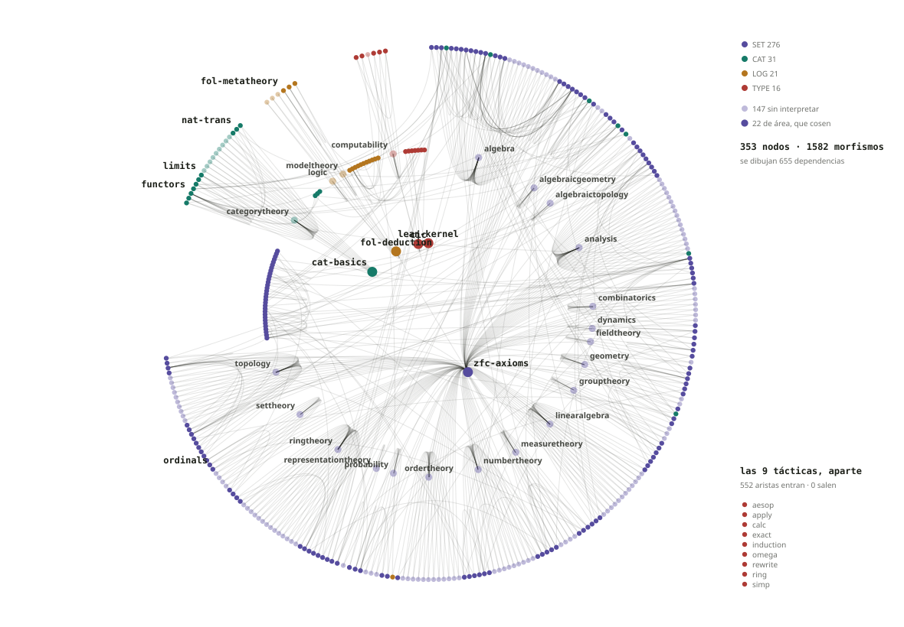

# METAMATEMÁTICO — Razonamiento Formal con Lean 4

[](https://lean-lang.org/)
[](https://python.org/)
[](#7-tests-y-guardianes)
[](#6-lo-que-está-medido)
[](#4-la-lista-183-433-hechos)
[](#3-el-grafo-de-qué-consta)
[](LICENSE)

**Leonardo Jiménez Martínez · BIOMAT · Centro de Biomatemáticas**

Una IA matemática que **no confía en el modelo de lenguaje para decidir si algo
es cierto**. El LLM formaliza en Lean 4, el kernel verifica, y sólo entonces se
traduce el resultado.

Alrededor de esa cadena hay **dos capas de conocimiento** con trabajos
distintos: un grafo pequeño y curado que dice *de qué habla* algo, y una lista
grande y extraída de Mathlib que dice *qué es cierto*. Ninguna de las dos
decide la verdad — eso es Lean, siempre.

> **Documentación visual completa** — [Metamatemático por dentro](https://claude.ai/code/artifact/8907db6a-017e-41ff-a434-b1eaf4ac0631):
> las dos capas, el grafo dibujado, lo que está medido, **lo que se midió y no
> sirve**, y los doce instrumentos rotos que hubo que cazar por el camino.
> Fuente en [`docs/arquitectura_nle.html`](docs/arquitectura_nle.html).

---

## Índice

1. [El flujo, de la entrada a la salida](#1-el-flujo-de-la-entrada-a-la-salida)
2. [Las dos capas](#2-las-dos-capas)
3. [El grafo: de qué consta](#3-el-grafo-de-qué-consta)
4. [La lista: 183 433 hechos](#4-la-lista-183-433-hechos)
5. [Lean y sus seis veredictos](#5-lean-y-sus-seis-veredictos)
6. [Lo que está medido](#6-lo-que-está-medido)
7. [Tests y guardianes](#7-tests-y-guardianes)
8. [Lo que se midió y no sirve](#8-lo-que-se-midió-y-no-sirve)
9. [Instalación y uso](#9-instalación-y-uso)
10. [Estructura del repositorio](#10-estructura-del-repositorio)
11. [Lo que no está](#11-lo-que-no-está)

---

## 1. El flujo, de la entrada a la salida

Todo pasa por `Nucleo.process(texto)`.

<p align="center">
  
</p>

| paso | quién | qué hace | ¿aporta? |
|---|---|---|---|
| 1 | **grafo** | nombres de Mathlib verificados al prompt | **sí — 12× sobre el azar** |
| 2 | LLM | escribe Lean 4 — no juzga si es correcto | — |
| 3 | **grafo** | elige qué módulos importa Lean | **inerte** |
| 4 | **Lean** | verifica · su veredicto es inapelable | — |
| 5 | LLM | traduce el código que Lean aceptó | — |
| 6 | **grafo** | ordena las tácticas si queda un `sorry` | **sí — 2,4× menos intentos** |

La última columna sale de medir cada punto por separado. **No hay un veredicto
único sobre «el núcleo»**: aporta en dos de sus puntos de actuación y es inerte
en un tercero. El detalle está en la [sección 6](#6-lo-que-está-medido) y los
negativos en la [8](#8-lo-que-se-midió-y-no-sirve).

---

## 2. Las dos capas

|  | el grafo | la lista |
|---|---|---|
| **qué guarda** | conceptos — *de qué habla* | hechos — *qué es cierto* |
| **tamaño** | 315 nodos | 183 433 entradas |
| **cómo se hizo** | 173 a mano + 125 generados | extraída del fuente, entera |
| **¿puede equivocarse?** | **sí** — es curación humana | no sobre sí misma |
| **estructura** | categórica: colímites, orden, pilares | plana, indexada |
| **en el flujo** | pasos 1, 3 y 6 | alimenta el índice de premisas |

**El puente ya existía.** Cada hecho de la lista lleva su `concepto`
—`Algebra.Order`, `Data.Set`— y ésos son exactamente los identificadores de los
125 nodos generados. No hubo que inventar la correspondencia: estaba en la ruta
del módulo.

### Por qué hacen falta las dos

Medido: de los 169 nombres que el grafo inyecta hoy, **3 son teoremas o lemas y
166 son tipos, estructuras y clases**. El grafo da los sustantivos.

Y ahí no es donde el modelo falla. De los 28 nombres que propuso de memoria, los
21 inexistentes eran *todos* lemas — `tsum_geometric_two`, `Subgroup.isCyclic`,
`isOpen_union`. El modelo acierta razonablemente los sustantivos e inventa los
hechos. **La lista existe para cubrir esa mitad.**

---

## 3. El grafo: de qué consta

<p align="center">
  
</p>

| pieza | cuántos | qué es |
|---|---|---|
| nodos curados | 173 | con veredicto categórico: «un objeto es un grupo, las flechas son homomorfismos» |
| nodos de área | 17 | leídos del anidamiento de módulos. Cosen los dos grafos: `Algebra`, `Topology`, `RingTheory`… |
| nodos generados | 125 | leídos de la taxonomía de Mathlib. Dicen *dónde vive* algo, no qué es. Marcados `interpretado=False` |
| dependencias | 1156 | prerrequisitos. Las de los generados salen del DAG de imports |
| traducciones | 439 | entre pilares — Curry-Howard, conjuntos↔categorías |
| analogías | 7 | correspondencias débiles, marcadas como tales |
| identidades | 315 | una por objeto, como exige la definición de categoría |

```bash
python scripts/dibujar_grafo.py     # regenera la figura desde el grafo real
```

### Las nueve tácticas son sumideros

`tactic-simp`, `tactic-ring` y las otras siete reciben **453 aristas y no emiten
ninguna**. Por eso están dibujadas aparte: dentro convertían el grafo en un
embudo donde cualquier recorrido terminaba.

Es una categoría-error del mismo tipo que se corrigió con la homología. Una
táctica no es una *cosa*, es una transformación de estado de prueba: como nodo
es un sumidero, como flecha compondría y tendría dominio y codominio.
**Identificado y sin arreglar.**

### Eran dos grafos, y ahora son uno

Medido: **cero aristas** entre los 173 curados y los 125 generados, sin contar
el enganche al pilar. `mathlib-linearalgebra-basis` alcanzaba 81 nodos hacia
arriba y **ni uno era curado** — no pasaba por `linear-algebra`, ni por
`module-theory`, ni por `ring-theory`, que existen.

La jerarquía ya estaba escrita en el **anidamiento de módulos** de Mathlib, y va
de lo general a lo especial — la misma dirección que el grafo curado seguía con
`group-theory → ring-theory → field-theory`.

```
                              antes    después
aristas que cruzan                0         88
generados con ancestro común   0/125    124/125
la lógica alcanza               158     284 de 315
```

Y faltaba **`fol-deduction → zfc-axioms`**: ZFC es una teoría de primer orden,
sus axiomas son fórmulas de primer orden con igualdad. Sin esa arista, media
matemática del grafo no tenía la lógica detrás. Una arista en vez de
trescientas. Es *curada*, no derivada — Mathlib no construye ZFC sobre
`Logic.Basic`.

**Lo que el esqueleto no da:** generados y curados son *hermanos* bajo un área,
no descendientes. La profundidad del módulo no ordena la generalidad —
`LinearAlgebra.Basis` está a profundidad 2 y `LinearAlgebra.Matrix.Defs` a 3, y
sin embargo el álgebra lineal es más general que la noción de base.

### El grafo tiene ciclos, y no son de la matemática

134 ciclos, todos entre los nodos generados; entre los 173 curados hay cero. Y
la causa es la agregación: el DAG oficial de Mathlib es **acíclico** —Lean
prohíbe imports circulares— pero al colapsar 7 747 módulos en conceptos de dos
niveles, aparecen.

```
Topology.Instances → Analysis.Asymptotics → Analysis.Complex → Topology.Instances
```

Son tres desarrollos distintos, no un recorrido. **El ciclo marca dónde la
división en ramas deja de funcionar.**

> **Un resultado negativo sobre las «áreas».** Se intentó definirlas por
> componentes fuertemente conexas, para que el corte lo dictara la estructura.
> No funciona: da una mega-área con 918 de los 1 358 conceptos. A nivel de
> fichero Mathlib es un DAG limpio; en cuanto se agrupa por ramas, casi todo
> queda entrelazado. **La descomposición en ramas no es recuperable de las
> dependencias** — el orden de construcción no respeta la frontera entre
> álgebra, topología y análisis.

---

## 4. La lista: 183 433 hechos

```
121 756  theorem        54 MB en disco
 50 835  lemma          1 102 conceptos distintos
 10 842  instance       3 sin enunciado utilizable (0,0 %)
```

```bash
python scripts/construir_lista_lemas.py --escribir
python scripts/construir_banco_lemas.py          # el banco de evaluación
```

### El DAG oficial, que no hubo que reconstruir

Mathlib trae la herramienta hecha, en `.lake/packages/importGraph`:

| comando | qué da |
|---|---|
| `lake exe graph` | el DAG completo — 21 446 aristas, 7 747 módulos, **0 ciclos** |
| `#min_imports` | los imports mínimos que necesita una declaración |
| `#find_home` | en qué módulo debería vivir una declaración |
| `#import_diff` | diferencia entre dos conjuntos de imports |

Al compararlo con el extractor propio apareció un fallo: el lector del fuente
metía unas 2 800 aristas falsas y con ellas un ciclo imposible de 1 244 módulos.
El oficial da cero, como debe.

### Mathlib no etiqueta por rama — etiqueta por táctica

Se buscó una anotación de área y no existe. Lo que sí hay, en 83 111 líneas y
162 atributos distintos, es qué herramienta puede usar cada lema:

```
@[simp]        40 736      @[gcongr]       575      @[continuity]  255
@[norm_cast]    2 257      @[grind]        547      @[mono]        244
@[fun_prop]     1 796      @[aesop]        286      @[measurability]
```

Es un índice *herramienta → lemas* curado por los mantenedores, y sirve: el
**42,1 %** de las premisas que citan las pruebas ya llevan `@[simp]`, y `simp`
las conoce sin que nadie se las pase. Filtrarlas movió la selección de premisas
de empatar con un prior de frecuencia (9,4 % contra 9,2 %) a superarlo
(14,0 % contra 11,7 %).

---

## 5. Lean y sus seis veredictos

Que Lean compile no significa que haya demostrado lo que se preguntó. El aviso
va **delante** del texto.

| salida | qué significa |
|---|---|
| **verificado** | hay teorema, lo prueba, y es el que se preguntó |
| **no hay prueba** | Lean aceptó el archivo, pero no contiene ningún teorema |
| **lo que pediste es falso** | Lean verificó la **negación** del enunciado |
| error de módulo | falta un import → se repara y se reintenta |
| error semántico | vuelve al LLM con el error de Lean, máximo 2 rondas |
| `sorry` | cascada de 12 tácticas, ordenadas por lo medido |

Las tres primeras existen porque las tres se dieron: el sistema llegó a estampar
«verificado» sobre un archivo de `#check` sin teoremas, y sobre la negación de lo
que se había pedido. Ninguna la encontraron los tests — las encontró correr el
sistema contra un banco de consultas reales.

---

## 6. Lo que está medido

Cada cifra con su método y su **modelo nulo**. Sin modelo nulo un porcentaje no
dice nada: *61 % de acierto* suena bien hasta que se sabe que responder siempre
lo mismo acierta el 79 %.

| qué | resultado | modelo nulo | veredicto |
|---|---|---|---|
| Vocabulario contra ProofNet<br><sub>371 ejercicios con formalización de oro</sub> | 13,6 % precisión | 1,1 % | **12× · aporta** |
| Dependencias contra el DAG real<br><sub>21 446 aristas oficiales</sub> | 78,1 % confirmadas | 32,6 % | **2,4× · aporta** |
| Orden de tácticas<br><sub>1 600 pruebas de Mathlib</sub> | 1,29 intentos | 2,59 | **−50 % · aporta** |
| Selección de premisas<br><sub>sin los `@[simp]`, que simp ya tiene</sub> | 14,0 % cobertura | 11,7 % | mejora pequeña |
| Elección de imports<br><sub>40 enunciados, Lean como juez</sub> | 90 % elabora | 90 % | **inerte** |
| Banco de fidelidad<br><sub>24 consultas, juez ciego al veredicto</sub> | 21/24 | — | **0 infieles** |
| Nombres de los nodos generados<br><sub>447 identificadores con `#check`</sub> | 346 existen | — | **95 no existen** |
| Poda por área antes de elegir<br><sub>con localización perfecta — el techo</sub> | 6,8 % | 9,8 % | **no llega al nulo** |

```bash
python scripts/recuperacion_contra_proofnet.py    # vocabulario
python scripts/funtor_dag_mathlib.py              # dependencias
python scripts/efecto_orden_cascada.py            # tácticas
python scripts/premisas_sin_simp.py               # premisas
python scripts/imports_del_grafo_contra_lean.py   # imports
python -m scripts.banco_fidelidad                 # fidelidad (usa API)
```

Todas sin API salvo la última.

### Respaldo formal

```
57/58  operaciones del Python con teorema Lean que las respalda
    0  sorry en todo el corpus (preguntado al compilador, no con grep)
  385  teoremas en 21 archivos Lean
```

`collectAxioms` confirma que ninguna constante depende de `sorryAx`.

---

## 7. Tests y guardianes

**788 tests en 37 suites.** Los que más valen no comprueban que el código
funcione, sino que **no vuelva a mentir**:

| guardián | qué impide |
|---|---|
| `test_cobertura_consultas` | que el grafo deje de engancharse con las consultas reales sin avisar |
| `test_interpretacion` | que un nodo generado se cuele como si estuviera interpretado |
| `test_domain_tactic_pipeline` | que el prior del área vuelva a adelantar al objetivo |
| rutas absolutas | que un `except` mudo degrade el sistema en silencio |
| cifras declaradas | que la documentación anuncie números que ya no son ciertos |

```bash
python -m pytest tests/ -o "addopts="
```

---

## 8. Lo que se midió y no sirve

Estos resultados costaron tanto trabajo como los positivos. Están aquí para que
nadie los repita.

**La elección de imports no aporta, y no queda margen.** Un conjunto fijo de
tres módulos hace elaborar el 92,5 % de los enunciados; añadirle lo del grafo da
el mismo 92,5 %. De 40 casos fallan 3: uno necesita `open Real`, otro usa
sintaxis vieja, y sólo uno es de imports. **Margen real: 2,5 puntos.**

**Las premisas no cierran pruebas.** Añadir tácticas con premisas costó 231
invocaciones extra de Lean y cerró **cero**. La razón es aritmética: la
cobertura es del 14 %, o sea una de cada siete, y una prueba las necesita
*todas*. Una métrica de recuperación **no se traduce en cierres**.

**Tres emparejadores fallaron, y la causa no era el emparejador.** Búsqueda
plana 43,9 %, descenso anclado en pilares 11,8 %, embeddings 11,9 % — los tres
por debajo del 79,4 % de decir siempre «álgebra». Para `(a+b)² = a²+2ab+b²`
**no existía el nodo**: las 35 skills de álgebra eran todas álgebra abstracta.

**Podar por área tampoco sirve, ni acertando el área.** Con localización
*perfecta* la cobertura sube de 6,0 % a 6,8 %; el modelo nulo da 9,8 %. Afinar
a sub-área empeora: el espacio se divide por cuarenta, el techo sube 0,3 puntos
y acertar es la mitad de fácil. Y una sospecha mía era falsa — el **77,1 %** de
las premisas está en la misma área que el teorema, así que la poda no tira lo
que hace falta: simplemente no ayuda.

**95 de los 447 nombres generados no existen en Mathlib.** Estaban *deducidos*
de la ruta del módulo; el filtro dejaba pasar `Basic` —un nombre de fichero—
igual que `Polynomial` —un tipo—. Sólo Lean distingue. Cuatro nodos se quedan
sin ningún nombre válido.

**La recuperación de lemas por contenido pierde contra la moda.** Sobre 23 243
pruebas reales: contenido 0,6 % de cobertura, ofrecer siempre los 20 lemas más
citados, 77 %. `sq_nonneg` no aparece en el enunciado ni tiene por qué — es una
*herramienta*, no un concepto del que el problema hable.

---

### El bucle que no cuesta dinero

El modelo formaliza una consulta **una vez**, se graba, y todo lo que el sistema
hace después —imports, reparación, cascada, premisas— se reejecuta con Lean de
juez y coste cero.

```bash
METAMAT_GRABAR=1 python -m nucleo chat     # graba mientras trabajas
python scripts/replay.py                   # reproduce, sin API
```

La frontera está donde tiene que estar: se graba el código del LLM *antes* de
que Lean lo vea. Si el gancho se moviera detrás, el replay mediría el sistema
contra su propia salida — hay un test que lo impide.

---

## 9. Instalación y uso

```bash
git clone https://github.com/metamatematico/Metamatematico---Razonamiento-Formal-con-Lean.git
cd Metamatematico
pip install -r requirements.txt

# Lean 4 + Mathlib
lake update && lake build          # 20-30 min la primera vez

# la clave de API, en .env (gitignored)
echo "ANTHROPIC_API_KEY=sk-..." > .env

streamlit run app.py               # interfaz
python -m nucleo chat              # REPL
```

Los índices derivados de Mathlib se reconstruyen con:

```bash
python -m scripts.mapa_modulos_mathlib
python scripts/construir_lista_lemas.py --escribir
python scripts/construir_indice_premisas.py
lake exe graph --to Mathlib data/mathlib_imports.dot
```

---

## 10. Estructura del repositorio

```
nucleo/
  core.py                 el orquestador: Nucleo.process()
  rutas.py                dónde está cada cosa, sin rutas absolutas
  graph/                  la categoría de conceptos
    interpretacion.py     el veredicto: qué es cada nodo, y su `teoria`
    complexity.py         colímites, orden, emergencia
  lean/
    client.py             habla con Lean
    solver_cascade.py     las 12 tácticas y su orden
    premisas.py           qué lemas citar cuando la táctica desnuda no basta
  pillars/
    math_domains.py       los 163 conceptos curados
    mathlib_taxonomy.py   los 125 generados (GENERADO — no editar a mano)

scripts/                  cada medición, con su método en el docstring
MetamathProver/           385 teoremas Lean · 21 archivos
tests/                    788 tests en 37 suites
data/                     índices derivados (los grandes van en .gitignore)
```

---

## 11. Lo que no está

**Sin respuesta todavía.** Si el vocabulario del paso 1 se traduce en más
verificaciones. Es la única pregunta que necesita llamar al modelo, y está
bloqueada por presupuesto. Lo que hay: en 8 casos fáciles apagar el núcleo
entero no cambia ningún veredicto y el sistema completo tarda más — n=8 con
efecto techo, no concluyente.

**Identificado y sin arreglar.**

- El emparejamiento consulta→concepto. **15 de 24 consultas reales no activan
  ninguna skill**, y los tres puntos donde el grafo actúa dependen de él.
- Las tácticas como nodos: 453 aristas entrando en 9 sumideros.
- Los nombres de los 125 nodos generados están *deducidos* de la ruta del
  módulo, no comprobados con `#check`. Por eso no se inyectan: al activarlos la
  precisión caía por debajo del azar.
- Seis dependencias siguen bajo sospecha de ir al revés.

**Lo que el sistema no hace.**

- No demuestra teoremas por sí solo: formaliza y verifica.
- El grafo no decide qué es cierto en ningún punto. Eso es Lean, siempre.
- Sin API no hay formalización, ni chat, ni banco de fidelidad. Lo que sigue
  vivo sin ella es validar y mejorar el núcleo.

---

**Licencia MIT** · Leonardo Jiménez Martínez, BIOMAT — Centro de Biomatemáticas
