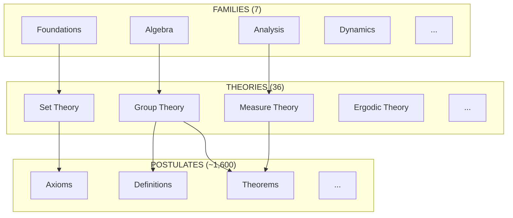
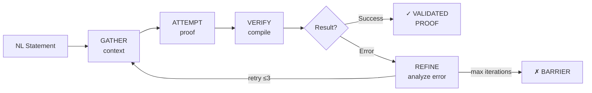
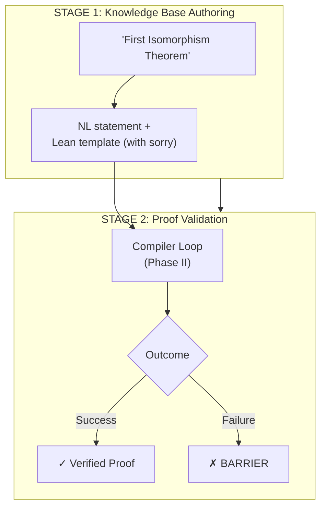
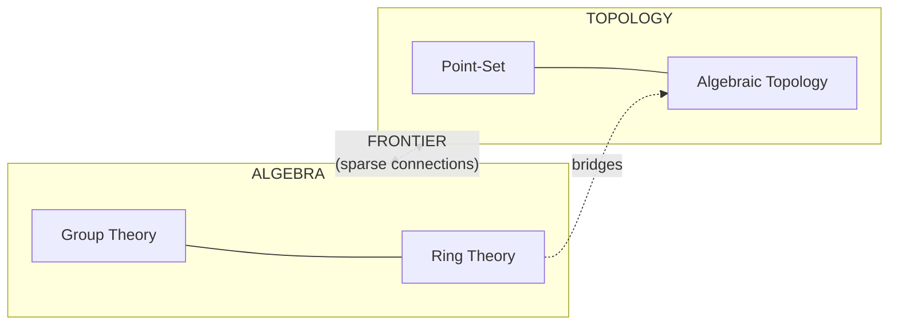

# The AI Mathematician: A Computational Approach to the Digitalization of Mathematics

**Project Proposal**

**Author**: Leonardo Jiménez Martínez

**Date**: December 16, 2025

**Version**: 1.0

---

## Abstract

We present a research program for the *digitalization of mathematics*: the systematic conversion of mathematical knowledge from natural language into machine-verifiable formal proofs organized as a navigable knowledge graph. The project addresses fundamental questions in automated reasoning by constructing (1) a typed knowledge graph $\mathcal{G}$ capturing the dependency structure of mathematical theories, (2) a compiler-driven proof generation system using the Lean 4 type checker as verification oracle, (3) a family of autoformalization models translating natural language to verified proofs, and (4) autonomous agents for frontier discovery and consistency verification. We formalize each component with mathematical precision and outline a phased implementation culminating in contributions to interactive theorem proving, neural theorem proving, and the foundations of mathematics.

---

## 1. Introduction and Motivation

### 1.1 The Metamathematical Research Program

The formalization of mathematical reasoning has been a central concern since Frege (1879), Russell and Whitehead (1910-1913), and Hilbert (1920s). Frege invented modern predicate logic with quantified variables—a language that remains foundational today. Russell and Hilbert pursued ambitious completeness programs: Russell's logicism aimed to reduce all mathematics to logic, while Hilbert's formalist program sought to prove that all true mathematical statements are provable within a finite axiomatic system. Both believed provability and truth would ultimately coincide.

Gödel's incompleteness theorems (1931) refuted these programs. Any consistent formal system capable of expressing arithmetic is necessarily incomplete: there exist true statements unprovable within the system, and the system cannot prove its own consistency. This does not undermine formalization itself—only the dream of a single, complete formal foundation. As Hofstadter observed [[1]](#references):

> *"The most urgent priority of metamathematicians was to determine the true nature of mathematical reasoning... This would require a complete codification of the universally acceptable modes of human reasoning."*

Modern proof assistants—Lean, Coq, Isabelle/HOL—inherit Frege's logical languages and operate within the post-Gödel reality: they cannot prove all truths or their own consistency, but they can verify proofs with absolute rigor and formalize essentially all mathematics that practitioners use. The Lean 4 type checker [[5]](#references), grounded in the Calculus of Inductive Constructions, serves as a verification oracle: a proof term is valid if and only if it type-checks—that is, if the term inhabits the corresponding type.

**Foundational Note**: Lean 4 is based on the Calculus of Inductive Constructions (CIC) [[5]](#references), a dependent type theory with an impredicative proof universe (`Prop`) and a countable hierarchy of predicative type universes (`Type u`). Carneiro [[8]](#references) proved that Lean's type theory is equiconsistent with ZFC augmented with finitely many inaccessible cardinals—meaning Lean can formalize essentially all classical mathematics. While Lean's core is constructive, Mathlib [[4]](#references) axiomatically assumes the law of excluded middle and axiom of choice, enabling classical reasoning patterns. Soundness is guaranteed relative to a small trusted computing base (kernel implementation, core axioms, metatheory); proofs are audited for dependencies on `sorry` (intentional holes) or unsafe axioms via `#print axioms`.

Yet mathematics remains predominantly expressed in natural language. The *autoformalization* problem—translating human mathematical text into verified formal proofs—is largely unsolved in the open-source domain.

### 1.2 The Gap We Address

Let $\mathcal{A}_{\text{open}}$ denote the set of open-source autoformalization systems and $\mathcal{A}_{\text{closed}}$ the closed systems (e.g., AlphaProof). Current state:

| System Class | Representative | Success Rate | Availability |
|--------------|----------------|--------------|--------------|
| $\mathcal{A}_{\text{closed}}$ | AlphaProof [[2]](#references) | IMO Gold | Closed |
| $\mathcal{A}_{\text{open}}$ | FormaRL [[6]](#references) | 26% | Open |
| Zero-shot LLM | GPT-4/Claude | 15-25% | Commercial |

We aim to construct an open-source system achieving $>50\%$ autoformalization success, organized around a structured knowledge graph rather than flat datasets.

### 1.3 Project Phases

The research program proceeds in four phases:

1. **Phase I**: Construction of the Mathematical Knowledge Graph $\mathcal{G}$
2. **Phase II**: Compiler-driven proof generation via iterative refinement
3. **Phase III**: Training autoformalization models on verified pairs
4. **Phase IV**: Autonomous frontier discovery and consistency verification

Each phase is associated with formal definitions and research contributions.

---

## 2. Phase I: The Mathematical Knowledge Graph

### 2.0 Conceptual Overview

Mathematics can be understood as a vast network where every theorem, definition, and axiom is a node, connected by logical dependencies. When we prove the First Isomorphism Theorem, we depend on the definition of a group homomorphism, which depends on the definition of a group, which rests on set-theoretic axioms. This dependency structure is not merely organizational—it is *computational*. An AI system navigating this graph can determine what prerequisites are needed before attempting a proof, identify "frontier" regions where few connections exist between major theories, and generate curriculum paths from foundations to advanced results.

**Example**: The First Isomorphism Theorem for groups states that for any group homomorphism $f: G \to H$, the quotient $G/\ker(f)$ is isomorphic to $\text{im}(f)$. In our graph, this theorem node connects to the definitions of group, homomorphism, kernel, and quotient group via `DEPENDS_ON` edges—forming a small subgraph within the larger algebraic structure.

### 2.1 Formal Definition

**Definition 2.1** (Mathematical Knowledge Graph). A *mathematical knowledge graph* is a tuple

$$\mathcal{G} = (V, E, \tau_V, \tau_E, \lambda)$$

where:

- $V$ is a finite set of vertices (mathematical postulates)
- $E \subseteq V \times V$ is a set of directed edges
- $\tau_V : V \to \mathcal{T}_V$ is a vertex typing function with

$$\mathcal{T}_V = \lbrace\mathsf{Axiom}, \mathsf{Definition}, \mathsf{Theorem}, \mathsf{Lemma}, \mathsf{Corollary}\rbrace$$

- $\tau_E : E \to \mathcal{T}_E$ is an edge typing function with

$$\mathcal{T}_E = \lbrace\mathsf{DEPENDS\text{-}ON}, \mathsf{GENERALIZES}, \mathsf{RELATES\text{-}TO}, \mathsf{PART\text{-}OF}\rbrace$$

- $\lambda : V \to \Sigma^* \times \Sigma^*$ assigns to each vertex a pair $(\text{nl}, \text{lean})$ of natural language and Lean 4 representations

### 2.2 Hierarchical Structure

**Definition 2.2** (Knowledge Hierarchy). The knowledge space admits a three-level hierarchy $(F, T, P)$ where:

- $F$ is a finite set of *families* (e.g., Foundations, Algebra, Analysis, Topology, Geometry, Discrete)
- $T$ is a finite set of *theories* (e.g., Set Theory, Group Theory, Measure Theory)
- $P = V$ is the set of *postulates*

with containment functions:

$$\pi_T : T \to F \qquad \text{(theory belongs to family)}$$
$$\pi_P : P \to T \qquad \text{(postulate belongs to theory)}$$

**Proposition 2.1**. The hierarchy $(F, T, P, \pi_T, \pi_P)$ induces a partial order $\preceq$ on $F \sqcup T \sqcup P$, forming a forest of height 2 (three levels: families at depth 0, theories at depth 1, postulates at depth 2).

### 2.3 Dependency Structure

**Definition 2.3** (Dependency Relation). The *depends-on* relation $\triangleleft \subseteq V \times V$ is defined by:

$$(u, v) \in \triangleleft \iff \tau_E((u,v)) = \mathsf{DEPENDS\text{-}ON}$$

We interpret $u \triangleleft v$ as "$u$ depends on $v$"—the proof of $u$ uses $v$ as a lemma or definition.

**Definition 2.4** (Transitive Closure). The *dependency closure* is:

$$\triangleleft^* = \bigcup_{n \geq 0} \triangleleft^n$$

where $\triangleleft^0 = \text{id}_V$ and $\triangleleft^{n+1} = \triangleleft \circ \triangleleft^n$.

**Axiom 2.1** (Acyclicity). For a well-founded mathematical theory:

$$\forall v \in V.\; (v, v) \notin \triangleleft^+$$

where $\triangleleft^+ = \triangleleft^* \setminus \text{id}_V$ is the proper transitive closure.

**Definition 2.5** (Foundational Postulates). The set of foundational postulates is:

$$\text{Found}(\mathcal{G}) = \{ v \in V : \neg\exists u \in V.\; v \triangleleft u \}$$

These are the sources in the dependency DAG—axioms and primitive definitions.

**Remark 2.6** (Future Applications). The family partition and dependency structure enable downstream applications including *frontier detection*—identifying sparse connections between mathematical domains where new bridging theorems may be discovered. This is formalized in Phase IV (§5.2).

### 2.4 Current Instantiation

| Parameter | Value |
|-----------|-------|
| $\|F\|$ | 7 families |
| $\|T\|$ | 36 theories |
| $\|V\|$ | ~1,600 postulates |
| Average $\|\triangleleft(v)\|$ | 3-5 dependencies per postulate |

---

## 3. Phase II: Compiler-Driven Proof Generation

### 3.0 Conceptual Overview

Traditional neural theorem provers treat proof search as exploration: generate many candidate tactics, evaluate which seem promising, and hope one leads to success. This approach is inherently probabilistic. We propose a different paradigm: **compiler-driven iteration**. The Lean compiler is not merely a verifier—it is an *oracle* that provides structured feedback. When a proof attempt fails, the compiler specifies *exactly* what went wrong: "unknown identifier", "type mismatch", "failed to synthesize instance". This transforms proof search into systematic debugging.

**Example**: To prove $\forall n : \mathbb{N}, 0 + n = n$, the system (1) gathers context identifying this as a natural number property, (2) attempts `theorem ex : ∀ n : ℕ, 0 + n = n := Nat.zero_add`, (3) verifies via the Lean compiler, which returns success. If instead the compiler returned "unknown identifier", the REFINE stage would search Mathlib [[4]](#references) for the correct lemma name and retry.

### 3.1 The Verification Oracle

**Definition 3.1** (Language Spaces). Let:

- $\mathcal{L}_{\text{NL}}$ = well-formed mathematical statements in natural language
- $\mathcal{L}_{\text{Lean}}$ = syntactically valid Lean 4 expressions
- $\mathcal{L}_{\text{Lean}}^{\checkmark} \subseteq \mathcal{L}_{\text{Lean}}$ = expressions that compile without error

**Definition 3.2** (Verification Oracle). The Lean 4 compiler [[5]](#references) defines an oracle:

$$\mathcal{C} : \mathcal{L}_{\text{Lean}} \to \{\top, \bot\} \times \Sigma^*$$

where $\mathcal{C}(e) = (\top, \varepsilon)$ indicates successful compilation and $\mathcal{C}(e) = (\bot, m)$ indicates failure with diagnostic message $m \in \Sigma^*$.

**Remark 3.1**. Unlike probabilistic verifiers, $\mathcal{C}$ is *deterministic* and *sound*: $\pi_1(\mathcal{C}(e)) = \top$ implies $e$ represents a valid proof in dependent type theory.

### 3.2 Proof State and Transition System

**Definition 3.3** (Proof State). A *proof state* is a tuple:

$$\sigma = (s, e, h, n) \in \Sigma_{\text{proof}}$$

where:
- $s \in \mathcal{L}_{\text{NL}}$ is the target statement
- $e \in \mathcal{L}_{\text{Lean}}$ is the current proof attempt
- $h \in (\mathcal{L}_{\text{Lean}} \times \Sigma^*)^*$ is the history of (attempt, error) pairs
- $n \in \mathbb{N}$ is the iteration count

**Definition 3.4** (Proof Engineer Transition). The proof engineer implements:

$$\delta : \Sigma_{\text{proof}} \to \Sigma_{\text{proof}} + \lbrace\mathsf{SUCCESS}, \mathsf{BARRIER}\rbrace$$

decomposed into four stages:

1. **GATHER**: $\text{gather} : \mathcal{L}_{\text{NL}} \to \mathcal{P}(\text{Strategy})$

   Analyzes goal structure, retrieves relevant context from $\mathcal{G}$.

2. **ATTEMPT**: $\text{attempt} : \mathcal{L}_{\text{NL}} \times \text{Strategy} \to \mathcal{L}_{\text{Lean}}$

   Generates proof candidate guided by selected strategy.

3. **VERIFY**: $\text{verify} = \mathcal{C}$

   Invokes the Lean compiler oracle.

4. **REFINE**: $\text{refine} : \mathcal{L}_{\text{Lean}} \times \Sigma^* \times h \to \text{Strategy}$

   Analyzes error, consults history, selects corrective strategy.

### 3.3 Fixed-Point Interpretation

**Definition 3.5** (Refinement Operator). Define the refinement operator on proof states:

$$F : \Sigma_{\text{proof}} \to \Sigma_{\text{proof}}$$

$$F(\sigma) = F(s, e, h, n) = \begin{cases}
(s, e, h, n) & \text{if } \pi_1(\mathcal{C}(e)) = \top \\
(s, e', h', n+1) & \text{otherwise}
\end{cases}$$

where $e' = \text{attempt}(s, \text{refine}(e, \pi_2(\mathcal{C}(e)), h))$ and $h' = h \cdot [(e, \pi_2(\mathcal{C}(e)))]$.

**Proposition 3.1**. A successful proof is a fixed point of $F$:

$$F(\sigma^*) = \sigma^* \quad \text{with} \quad \pi_1(\mathcal{C}(\pi_2(\sigma^*))) = \top$$

The proof engineer computes the Kleene iteration:

$$\sigma^* = F^{N_{\max}}(\sigma_0)$$

with $N_{\max} = 3$ (barrier after three failed attempts).

### 3.4 Termination Conditions

**Definition 3.6** (Termination). The proof sequence terminates when:

1. **Success**: $\pi_1(\mathcal{C}(e_n)) = \top$
2. **Barrier**: $n \geq N_{\max}$

**Heuristic 3.1** (Weak Monotonicity). For theorems with full Mathlib coverage, we expect refinement to generally improve proof attempts. Informally:

$$\mathbb{P}[\text{closer to valid proof after refinement}] > 1 - \epsilon$$

where $\epsilon$ is small. Formalizing "closeness" requires a proof distance metric (e.g., edit distance on syntax trees, or semantic similarity based on type alignment), which we leave to future work.

---

## 4. Phase III: Autoformalization Training

### 4.0 Conceptual Overview

Autoformalization is the central challenge: given a mathematical statement in natural language, produce a complete, verified formal proof. This is fundamentally different from tactic generation, which assumes one is already inside a proof assistant with a well-defined goal state. Autoformalization is end-to-end translation from human mathematics to machine-verified truth.

The key architectural insight is separation of concerns: *what to prove* (Stage 1, human-guided knowledge base authoring) is distinct from *how to prove it* (Stage 2, automated compiler-driven refinement). This modularity enables construction of high-quality training data even when some proofs require human assistance, as failures are isolated to Stage 2 without contaminating the knowledge base.

### 4.1 The Autoformalization Function

**Definition 4.1** (Autoformalization). An *autoformalization function* is a partial function:

$$\varphi : \mathcal{L}_{\text{NL}} \rightharpoonup \mathcal{L}_{\text{Lean}}$$

**Remark 4.1**. Partiality is essential: not every natural language statement admits formalization (ambiguity, vagueness, statements outside type theory).

### 4.2 Two-Stage Pipeline

**Definition 4.2** (Knowledge Base Authoring). Stage 1 produces templates:

$$\alpha : \mathcal{L}_{\text{NL}} \to \mathcal{L}_{\text{NL}} \times \mathcal{L}_{\text{Lean}}$$

where $\alpha(s) = (s, e_{\text{template}})$ and $e_{\text{template}}$ may contain `sorry` placeholders.

**Definition 4.3** (Proof Validation). Stage 2 validates templates:

$$\beta : \mathcal{L}_{\text{NL}} \times \mathcal{L}_{\text{Lean}} \rightharpoonup \mathcal{L}_{\text{Lean}}^{\checkmark}$$

using the proof engineer from Phase II.

**Proposition 4.1** (Pipeline Composition). The full autoformalization is:

$$\varphi = \pi_2 \circ \beta \circ \alpha$$

### 4.3 Training Objective

Given validated pairs $\mathcal{D} = \{(s_i, e_i) : \pi_1(\mathcal{C}(e_i)) = \top\}_{i=1}^{N}$, we train a neural model $\varphi_\theta$ to minimize:

$$\mathcal{L}(\theta) = -\sum_{(s,e) \in \mathcal{D}} \log p_\theta(e | s)$$

with verification-based filtering: only pairs satisfying $\pi_1(\mathcal{C}(e)) = \top$ enter $\mathcal{D}$.

### 4.4 Success Metric

**Definition 4.4** (Autoformalization Success Rate). For test set $\mathcal{D}_{\text{test}}$:

$$\text{ASR}(\varphi_\theta) = \frac{|\{(s,e) \in \mathcal{D}_{\text{test}} : \varphi_\theta(s) \text{ is defined} \land \pi_1(\mathcal{C}(\varphi_\theta(s))) = \top\}|}{|\mathcal{D}_{\text{test}}|}$$

where undefined outputs (when the model fails to produce any candidate) count as failures.

**Target**: $\text{ASR} > 0.5$ (vs. current open-source SOTA of 0.26).

---

## 5. Phase IV: Frontier Discovery and Consistency Verification

### 5.0 Conceptual Overview

Once we have a knowledge graph and proof generation system, a natural question emerges: can we discover new mathematics, not merely formalize existing results? The knowledge graph reveals structural patterns that humans might overlook. Consider two mathematical families—Algebra and Topology—with few connecting edges. This "sparse region" is a *frontier*: a site where new theorems might bridge disparate domains.

Algebraic topology is precisely the field that bridges this frontier—the fundamental group, homology, and cohomology are theorems connecting algebraic structures to topological spaces. An autonomous discovery agent could detect such sparse inter-family regions, analyze what structural properties might transfer across the frontier, and propose candidate theorems for human review before attempting formalization.

### 5.1 Autonomous Exploration

**Definition 5.1** (Discovery Agent). A discovery agent is a function:

$$\mathcal{A} : \mathcal{G} \times \text{Query} \to \mathcal{P}(V) \times \text{Hypothesis}$$

that navigates the knowledge graph, identifies regions of interest, and proposes new mathematical statements.

### 5.2 Frontier Identification

With a populated knowledge graph from Phase I and compiled proof corpus from Phase II, we can identify mathematical frontiers—underexplored connections between domains.

**Intuition**: If Group Theory and Topology have many theorems but few cross-references, this suggests opportunities for bridging work (e.g., topological groups, fundamental groups).

**Definition 5.2** (Family Assignment). For convenience, define the family assignment function:

$$\phi : V \to F, \quad \phi(v) = \pi_T(\pi_P(v))$$

mapping each postulate $v$ to its mathematical family.

**Definition 5.3** (Cross-Family Edge Density). For non-empty families $f_1, f_2 \in F$ with $\|V_{f_1}\|, \|V_{f_2}\| > 0$, define:

$$\rho(f_1, f_2) = \frac{\|E_{f_1 \to f_2}\|}{\|V_{f_1}\| \cdot \|V_{f_2}\|}$$

where $E_{f_1 \to f_2} = \{(u,v) \in E : \phi(u) = f_1 \land \phi(v) = f_2\}$ and $V_f = \{v \in V : \phi(v) = f\}$. For empty families, $\rho$ is undefined.

**Definition 5.4** (Mathematical Frontier). A pair $(f_1, f_2)$ is a *frontier* if:

$$\rho(f_1, f_2) < \theta$$

for threshold $\theta > 0$. The agent identifies all frontiers:

$$\text{Frontiers}(\mathcal{G}, \theta) = \{(f_1, f_2) \in F \times F : \rho(f_1, f_2) < \theta\}$$

These sparse inter-family connections suggest opportunities for new theorems bridging disparate domains.

### 5.3 Toward Consistency Verification

**Remark 5.1** (On Incompleteness). We must distinguish two notions:

1. **Logical incompleteness** (Gödel): Any consistent system capable of expressing arithmetic cannot prove all true statements about natural numbers. Since we require consistency, logical incompleteness is automatic—not a defect to detect but a fundamental property.

2. **Computational incompleteness**: Whether the proof engineer halts, whether all cases in a proof are covered, whether a formalization attempt exhausts its retry budget.

A critical limitation: detecting *which* statements are undecidable within a theory is itself undecidable. To prove a statement independent of a theory $T$, one must work in a stronger meta-theory $T' \supset T$. This is not something our system can automate in general.

**Definition 5.5** (Consistency Verification). What *is* achievable is local consistency checking. Given a theory fragment $\Gamma \subseteq V$ and a candidate statement $s$, the Lean type checker verifies:

$$\mathcal{C}(\Gamma \vdash s) = \top \implies \Gamma \cup \{s\} \text{ is consistent (relative to Lean's type theory)}$$

The compiler-driven loop (Phase II) provides this: a successful compilation witnesses that the statement is consistent with its dependencies.

**Definition 5.6** (Coverage Signal). For computational completeness, we track:

- **Case coverage**: All constructors of an inductive type handled in pattern matching
- **Termination**: Recursive functions decrease on a well-founded measure
- **Goal closure**: No remaining `sorry` placeholders in the proof term

These are decidable properties that Lean verifies automatically.

**Remark 5.2**. Detecting statements equivalent to known independence results (CH, AC over ZF) remains of theoretical interest, but we do not claim automated detection of logical undecidability—only that the knowledge graph structure may flag statements with structural similarity to known independent propositions, for human review.

---

## 6. Measurability and Prioritization

### 6.1 Formalizability Score

**Definition 6.1** (Measurability Function). Define:

$$\mu : V \to [0, 100]$$

where $\mu(v)$ quantifies how readily postulate $v$ can be formalized using Mathlib.

**Definition 6.2** (Composite Score). Measurability is computed as:

$$\mu(v) = \sum_{i=1}^{k} w_i \cdot \mu_i(v), \quad \sum_{i} w_i = 1$$

with components:

| Factor | Weight | Description |
|--------|--------|-------------|
| $\mu_{\text{coverage}}$ | 0.40 | Mathlib coverage |
| $\mu_{\text{gap}}$ | 0.25 | Dependency gap severity |
| $\mu_{\text{tactics}}$ | 0.20 | Proof complexity |
| $\mu_{\text{typeclass}}$ | 0.15 | Algebraic hierarchy stability |

### 6.2 Priority Ordering

**Definition 6.3** (Processing Order). Measurability induces a preorder:

$$v_1 \preceq_\mu v_2 \iff \mu(v_1) \geq \mu(v_2)$$

Dataset generation proceeds in $\preceq_\mu$ order, maximizing validated proofs per unit effort.

---

## 7. Research Contributions and Timeline

### 7.1 Associated Publications

| Phase | Paper | Target Venue |
|-------|-------|--------------|
| I | *A Graph-Theoretic Representation of Mathematical Knowledge* | ITP 2026 |
| II | *Deterministic Proof Synthesis via Compiler-in-the-Loop Iteration* | CADE 2027 |
| III | *Open-Source Autoformalization: From NL to Verified Lean Proofs* | NeurIPS 2026 |
| IV | *Autonomous Mathematical Discovery via Knowledge Graph Navigation* | Future |

### 7.2 Timeline

| Milestone | Target |
|-----------|--------|
| Knowledge graph deployed ($\mathcal{G}$ operational) | Q2 2025 |
| Proof engineer validates 500 theorems | Q3 2025 |
| Autoformalization model trained | Q4 2025 |
| Paper I submitted | Q1 2026 |
| Paper III submitted | Q2 2026 |
| Paper II submitted | Q3 2026 |

---

## 8. Current Assets

| Asset | Status | Quantity |
|-------|--------|----------|
| Knowledge bases | Complete | 36 theories |
| Mathematical statements | Authored | ~1,600 |
| Lean 4 templates | Authored | ~1,600 |
| Proof skills | Implemented | 14 |
| Verified proofs | Validated | 8 (isomorphism theorems) |

---

## Appendix A: Notation Reference

| Symbol | Meaning |
|--------|---------|
| $\mathcal{G}$ | Mathematical knowledge graph |
| $V, E$ | Vertices (postulates), edges (relations) |
| $\tau_V, \tau_E$ | Vertex and edge typing functions |
| $\triangleleft$ | Depends-on relation |
| $\triangleleft^*$ | Transitive-reflexive closure |
| $\mathcal{L}_{\text{NL}}, \mathcal{L}_{\text{Lean}}$ | Natural language and Lean expression spaces |
| $\mathcal{L}_{\text{Lean}}^{\checkmark}$ | Verified Lean expressions |
| $\mathcal{C}$ | Lean compiler oracle |
| $\varphi$ | Autoformalization function |
| $\alpha, \beta$ | Stage 1 (authoring) and Stage 2 (validation) |
| $\delta$ | Proof engineer transition function |
| $\mu$ | Measurability function |
| $F, T, P$ | Families, Theories, Postulates |
| $\pi_T, \pi_P$ | Containment projections |
| $\rho(f_1, f_2)$ | Cross-family edge density |

---

## Appendix B: Category-Theoretic Perspective

For specialists in category theory, we note the following interpretations:

**Remark B.1**. The knowledge graph $\mathcal{G}$ admits interpretation as a *presheaf* on a small category $\mathbf{Math}$ whose objects are theories and morphisms are inclusions/generalizations.

**Remark B.2**. Autoformalization $\varphi$ can be viewed as a partial functor:

$$\varphi : \mathbf{NL} \rightharpoonup \mathbf{Lean}$$

from the category of natural language statements (with logical entailment as morphisms) to the category of Lean types (with term inhabitation as morphisms).

**Remark B.3**. The proof engineer loop can be viewed coalgebraically. Define the functor $T(X) = X + \mathsf{Outcome}$ where $\mathsf{Outcome} = \{\mathsf{SUCCESS}, \mathsf{BARRIER}\}$. The transition function:

$$\delta : \Sigma_{\text{proof}} \to T(\Sigma_{\text{proof}}) = \Sigma_{\text{proof}} + \mathsf{Outcome}$$

defines a $T$-coalgebra, capturing the potentially infinite iteration with termination behavior.

---

## References

1. Hofstadter, D. R. (1979). *Gödel, Escher, Bach: An Eternal Golden Braid*. Basic Books.

2. Trinh, T. H., et al. (2025). Solving Olympiad Geometry without Human Demonstrations. *Nature*.

3. Yang, K., et al. (2023). LeanDojo: Theorem Proving with Retrieval-Augmented Language Models. *NeurIPS*.

4. The Mathlib Community. (2020). The Lean Mathematical Library. *CPP*.

5. de Moura, L., & Ullrich, S. (2021). The Lean 4 Theorem Prover and Programming Language. *CADE*.

6. Polu, S., et al. (2023). Formal Mathematics Statement Curriculum Learning. *ICLR*.

7. Jiang, A. Q., et al. (2023). Draft, Sketch, and Prove: Guiding Formal Theorem Provers. *ICLR*.

8. Carneiro, M. (2019). *The Type Theory of Lean*. Master's thesis, Carnegie Mellon University.

---

*This proposal presents a rigorous framework for the computational digitalization of mathematics. We welcome feedback from the mathematical community on the formalization choices, scope, and research directions.*
